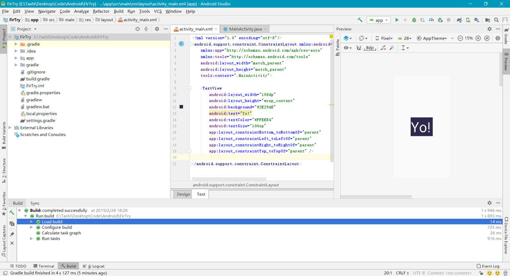

### [# 创建工程]

- 1.下载JDK（java）
- 2.下载Android Studio
- 3.下载Android sdk

**创建完毕**



### 第一个安卓应用程序

`activity_main.xml`

```xml
<?xml version="1.0" encoding="utf-8"?>
<AbsoluteLayout
    xmlns:android="http://schemas.android.com/apk/res/android"
    android:layout_width="match_parent"
    android:layout_height="match_parent"
    >
    <Button
        android:id="@+id/show"
        android:layout_width="match_parent"
        android:layout_height="69dp"
        android:layout_x="0dp"
        android:layout_y="238dp"
        android:text="Click!"
        android:onClick="firCli"
        />

    <TextView
        android:id="@+id/textView"
        android:layout_width="314dp"
        android:layout_height="137dp"
        android:layout_x="59dp"
        android:layout_y="346dp"
        android:text="Plase Click this Button"
        android:gravity="center"
        />
</AbsoluteLayout>
```

`MainActivity.java`

```java
package itaolaity.com;

import android.annotation.SuppressLint;
import android.support.v7.app.AppCompatActivity;
import android.os.Bundle;
import android.view.View;
import android.widget.TextView;
import java.util.*;

public class MainActivity extends AppCompatActivity {

    @Override
    protected void onCreate(Bundle savedInstanceState) {
        super.onCreate(savedInstanceState);
        setContentView(R.layout.activity_main);
    }

   
    public void firCli(View V){
        TextView res = (TextView) findViewById(R.id.textView);
        res.setText("Hello, World!"+new Date());
    }

}
```

**解析**

1. 加入两个控件

   1. TextView文本框
   2. Button按钮

2. `android:id`该控件的唯一标识可以通过`findViewById("id")`来获取指定的界面组件

3. `android_width`控件的宽度

   1. `match_parent`宽度与父容器相同的宽度
   2. `wrap_content`宽度取决于内容

   


### 真机测试

使用手机测试程序


> Oppo手机出现安装包异常

**解决方法**

在`gradle.properties` 文件中，添加一行代码

```properties
android.injected.testOnly=false
```

### Android Studio打包APK

**为什么打包**

提供给别人用

**打包分类**

- debug
- release

release版的apk会比debug版的小，release版的还会进行混淆和用自己的keystore签名，以防止别人反编译后重新打包替换你的应用

身份验证文件`.jks`

**打包方法**

- 没有`.jks`文件打包

1. `Build -> Generate Signed APK`


2. 填写


3.如果没有密匙就点击生成密匙

