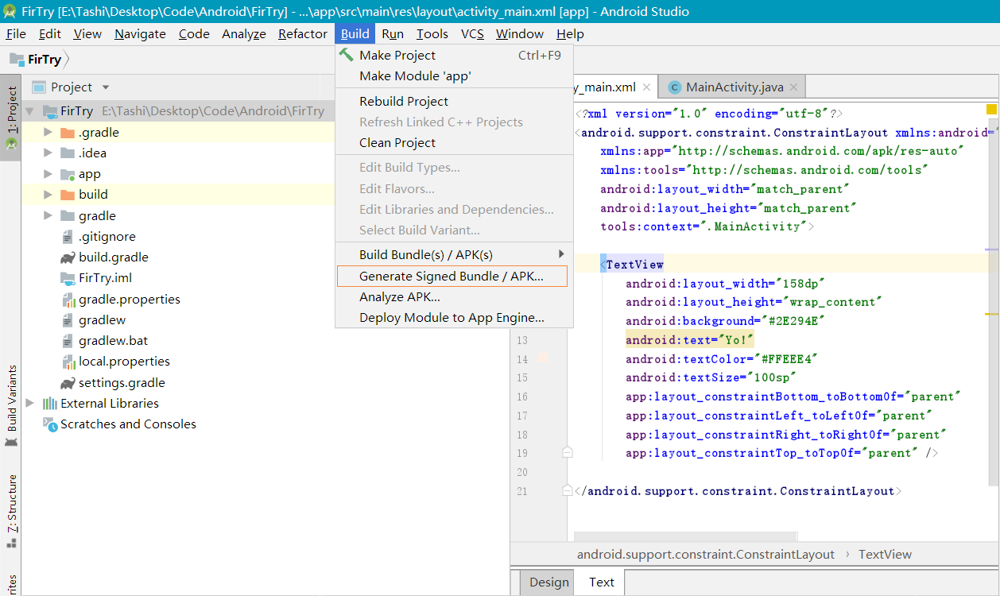
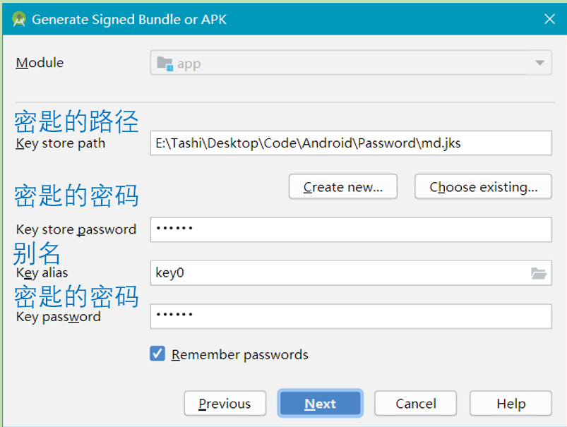
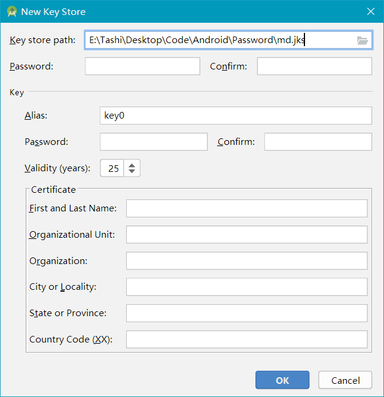

### [# 创建工程]

- 1.下载JDK（java）
- 2.下载Android Studio
- 3.下载Android sdk

**创建完毕**

### 【#Android Studio打包APK】

**为什么打包**

提供给别人用

**打包分类**

- debug
- release

release版的apk会比debug版的小，release版的还会进行混淆和用自己的keystore签名，以防止别人反编译后重新打包替换你的应用

身份验证文件`.jks`

**打包方法**

- 没有`.jks`文件打包

1> `Build -> Generate Signed APK`

2> 填写

3> 如果没有密匙就点击生成密匙

