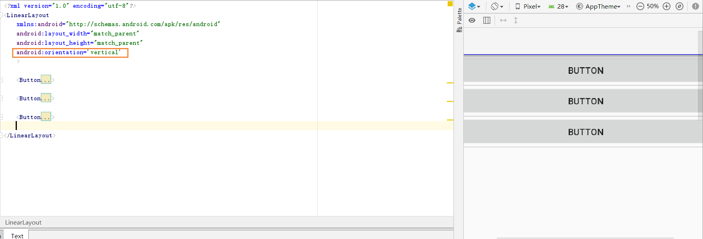

# 布局

---

> 前

**布局常用的单位**

- 像素单位px

- 适配单位dp

- 字体单位sp

`dp` 标准屏幕160dpi

如果屏幕dpi = 500 那么1dp = 3.125px

### 一.线性布局

`LinearLayout`

把控件摆在同一条线上

- **设置**

`activity_main.xml`

```
<?xml version="1.0" encoding="utf-8"?>
<LinearLayout
    xmlns:android="http://schemas.android.com/apk/res/android"
    android:layout_width="match_parent"
    android:layout_height="match_parent">


    
</LinearLayout>
```

#### LinearLayout常用XML属性

- **线性布局摆放的方向**

`android:orientation='vertical| horizontal'`

1. `horizontal`横向
2. `vertical`纵向



`android:gravity`控制它所包含的子元素的对齐方式

- top、bottom、left、right
- fill_vertical、fill_horizontal、fill
- center_vertical、center_horizontal、center

```xml
android:gravity="left|center_vertical" //左边并且垂直居中
```

#### LinearLayout子元素的XML属性

- **权重分配**

`android:layout_weight="2"`

```
<Button
        android:layout_width="0dp"
        android:layout_weight="2"
        android:layout_height="wrap_content"
        android:text="Button" />
```

1. 权重计算方法?

把所有数字加起来,占的就是总的百分比

- **对其方式**

`android:layout_gravity`

指定子元素在LinearLayout的对齐方式


### 二.相对布局

**相对布局相对父控件**

- android:layout_centerInParent="true"  #中间
- android:layout_alignParentBottom="true" #下面
	- android:layout_alignParentTop="true" 
- android:layout_alignParentRight="true"#右边
	- android:layout_alignParentLeft="true"

**相对布局相对兄弟控件**

```
<?xml version="1.0" encoding="utf-8"?>
<RelativeLayout
    xmlns:android="http://schemas.android.com/apk/res/android"
    android:layout_width="match_parent"
    android:layout_height="match_parent"
    android:orientation='horizontal'
    >


    <Button
        android:id="@+id/center_button"
        android:layout_width="wrap_content"
        android:layout_height="wrap_content"
        android:text="中间"
        android:layout_centerInParent="true"
        />
    <!--中间的上方-->
    <Button
        android:id="@+id/button16"
        android:layout_centerHorizontal="true"
        android:layout_above="@id/center_button"

        android:layout_width="wrap_content"
        android:layout_height="wrap_content"
        android:text="中上" />
</RelativeLayout>
```

- `android:layout_above="@id/center_button"`上
- `android:layout_toLeftOf="@id/center_button"`左
- `android:layout_toRightOf="@id/center_button"`右
- `android:layout_below="@id/center_button"`下


### 三.绝对布局

`AbsoluteLayout`


### 四.表格布局

`TableLayout`继承`LinearLayout`

通过添加TableRow代表一行

| XML属性                 | 方法                             | 说明                                               |
| ----------------------- | -------------------------------- | -------------------------------------------------- |
| android:collapseColumns | setColumnCollapsed(int, boolean) | 设置需要被隐藏的列的序列号，多个序列之间用逗号分割 |
| android:shrinkColumns   | setShrinkAllColumns(boolean)     | 设置允许被收缩的列的序列号                         |
| android:stretchColumns  | setStretchAllColumns(boolean)    | 设置允许被拉伸的列的序列号                         |


```
<TableRow>
	
</TableRow>
```

### 五.帧布局

`FrameLayout`

```

```