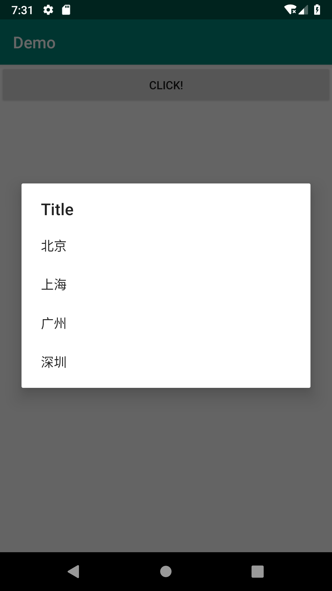
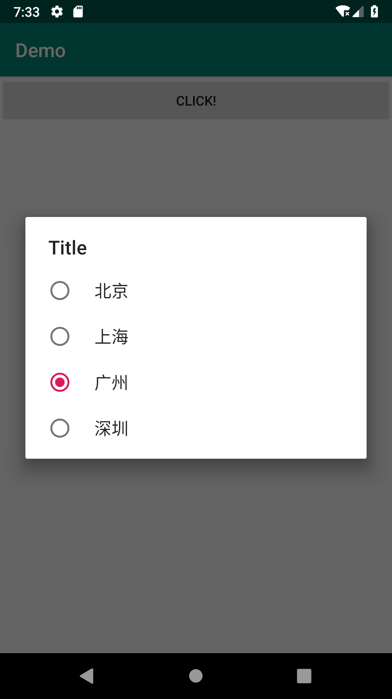

### #对话框


常用对话框

- AlertDialog
- ProgressDialog
- DatePickerDialog
- TimePickerDialog


> AlertDialog


**步骤**

1. 创建AlertDialog.builder对象
2. setTitle()和setCustomTitle()方法。设置标题
3. setIcon设置图标
4. setMessage设置内容
5. AlertDialog.Builder的setPositiveButton(),setNegativeButton(),setNeutralButton()添加按钮
6. 调用Builder对象的create()方法创建AlertDialog对象
6. 调用show()方法就对话框显示出来


- setMessage：设置对话框内容为简单文本内容
```java
<!-- Main Code -->
//    点击触发函数
public void fun(View v){
    Button btn = (Button)findViewById(R.id.clc); //创建对象

    AlertDialog.Builder builder = new AlertDialog.Builder(this);
    builder.setTitle("Title"); //添加标题
    builder.setMessage("Content！"); //添加内容

    builder.setPositiveButton("Yes", new DialogInterface.OnClickListener() { //添加按钮
        @Override
        public void onClick(DialogInterface dialog, int which) {
            Toast.makeText(MainActivity.this, "You Choice yes",Toast.LENGTH_SHORT).show();
        }
    });
    builder.setNegativeButton("No", new DialogInterface.OnClickListener() { //添加按钮
        @Override
        public void onClick(DialogInterface dialog, int which) {
            Toast.makeText(MainActivity.this, "You Choice no",Toast.LENGTH_SHORT).show();
        }
    });

    builder.create().show(); //展示
    Toast.makeText(MainActivity.this, "Jump Window", Toast.LENGTH_SHORT).show();

}
```

- setItems设置文本框内容为简单列表项
```java
// Main Code

//    点击触发函数
    public void fun1(View v){
        //创建数据
        final String[] items = {"北京","上海","广州","深圳"};
        //创建对话框构建器
        AlertDialog.Builder builder = new AlertDialog.Builder(this);
        //设置参数
        builder.setTitle("Title");
        builder.setItems(items, new DialogInterface.OnClickListener() {
            @Override
            public void onClick(DialogInterface dialog, int which) {//点击监听
                //显示点击的数据元素
                Toast.makeText(MainActivity.this, items[which],Toast.LENGTH_SHORT).show();
            }
        });
        //将对话框显示出来
        builder.create().show();
    }
```


- setSingleChoiceItems()设置对话框内容为单选列表框
```java
// 点击触发函数
public void fun2(View v){
    //创建数据
    final String[] items = {"北京","上海","广州","深圳"};
    //创建对话框构建器
    AlertDialog.Builder builder = new AlertDialog.Builder(this);
    //设置参数
    builder.setTitle("Title");
    builder.setSingleChoiceItems(items,0,new DialogInterface.OnClickListener() {
        @Override
        public void onClick(DialogInterface dialog, int which) {//点击监听
            //显示点击的数据元素0
            Toast.makeText(MainActivity.this, items[which],Toast.LENGTH_SHORT).show();
        }
    });
    //将对话框显示出来
    builder.create().show();
}
```


- setMultiChoiceItems()设置对话框内容为多选项列表