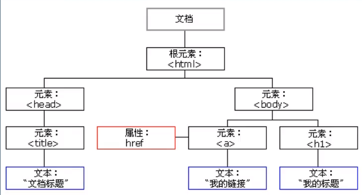

# DOM

**简介**

文档对象模型（Document Object Model）

**DOM数据结构（树状）**



**作用**

1. 找元素
2. 设置元素实行
3. 设置元素样式
4. 添加和删除元素
5. 事件触发响应

### DOM访问关系

- 单个节点
- 父子关系
- 兄弟关系

**获取子节点**

- childNodes
- children

**获取第一个子节点**

- firstChild
- firstElementChild

**获取最后一个子节点**

- lastChild
- lastEhlementChild

**获取父节点**

- parentNode
- parentElement
- offsetParent //Body下所有节点

**获取上一个兄弟节点**

- previousSibling
- previousElementSibling

**获取下一个兄弟节点**

- nextSibling
- nextElementSibling

```javascript
var sonNode = btn.parentElement.children;

for(var i=0; i<sonNode.length; i++) {
  console.log(s[i]);
}
```

### DOM节点操作

- 创建节点

节点 = document.createElement("标签名");

```javascript
var img = document.createElement("img"); // 拿到节点
img.src = "imgs/bg1.jpg";  //设置属性
```

- 插入节点

父节点.appendChild(节点);

父节点.insertBefor(新节点,参考节点);

```javasacript
var img = document.createElement("img"); // 拿到节点
img.src = "imgs/bg1.jpg";  //设置属性

var box = document.getElementById("box");
box.appendChild(img);        //插入节点
```

- 删除节点

父节点.remouveChild(子节点);

当前节点.remove();

```java
var box = document.getElementById("box"); //找到节点

box.remove();   //找到自己把自己删除了
```

- 复制节点

oldNode.cloneNode(true);

```java
var box = document.getElementById("box"); //查找

var newTag = box.cloneNode(true); //复制

box.appendChild(newTag); //添加
```

### 节点属性

**查看属性**

```
var box = document.getElementById("box"); //Find

/*获取属性*/
console.log(box.getAttribute("id"));
console.log(box.getAttribute("name"));
```


**修改属性**

```java
var box = document.getElementById("box"); //Find

box.setAttribute("My","gulu"); //Insert
console.log(box);
```


**删除属性**

```java
var box = document.getElementById("box"); //Find
box.removeAttribute("id");  //Delete
```


