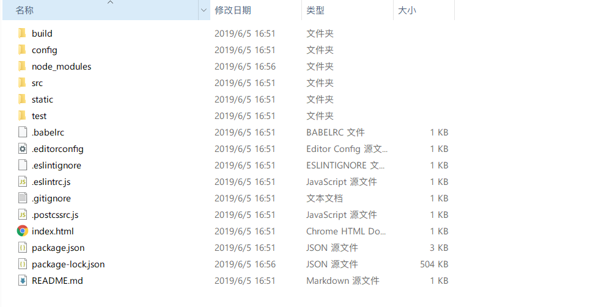

# Vue-cli初步使用

> 前提条件

1. 安装node.js
2. 安装vue-cli

```bash
# 查看node版本
node -v

# 查看npm版本
npm -v
```

## 简单却不失优雅，小巧而不乏大匠(认知)

### 脚手架

**是什么**

前端的脚手架可以理解为能够帮助我们快速构建前端项目的一个工具或平台。就像生活中工地搭建的架子。

### vue-cli

 Vue 的脚手架工具 vue-cli。默认已经搭建好了一个项目的基本架子。我们在基础上进行相应的修改

```bash
#安装
npm -g vue-cli
```


## 开始

### 创建项目

`vue create webpack xxx(xxx代表项目名)`

终端出现问答模式

- Project name 项目名称
- Project description 项目描述
- Author 作者
- Install vue-router 是否需要vue-router
- Use ESLint to lint your code 是否使用ESLint
- Setup unit tests with Karma + Moch? 是否安装单元测试
- Setup e2e tests with Nightwatch 是否安装e2e测试


经过上面的确认项目已经搭建起来了。接下来进入项目 安装项目依赖模块`npm install`,然后项目里会多出一个node_modules文件夹，安装的依赖模块都在这个文件夹里面。


### 目录结构


#### Vue-cli 2.x



- build （项目构建webpack相关代码）
  - build.js 生产环境构建代码
  - check-version.js 检查node，npm版本
  - utils.js 构建工具相关
  - webpack.base.config.js 基本配置
  - webpack.dev.config.js 开发配置
  - webpack.prod.config.js 生产环境配置
- config （构建配置目录）
  - dev.env.js 开发环境变量
  - index.js 相配配置变量
  - prod.env.js 生产环境变量
  - test.env.js
- src 项目的组件与**入口文件**
  - assets 样式、图片等资源文件
  - components 组件目录
  - router 路由配置目录
  - App.vue 文件入口
  - main.js 入口
- static 静态文件目录
- package.json 项目描述文件

#### vue-cli 3.x

```
|-- dist                       # 打包后文件夹            
|-- node_modules               # 第三方包，依赖的包文件      
|-- public                     # 静态文件夹                                   
|   |-- favicon.ico                
|   |-- index.html                     #入口页面
|-- src                        # 源码目录         
|   |--assets                          # 模块资源
|   |--components                      # vue公共组件
|   |--views                         
|   |--App.vue                         # 页面入口文件
|   |--main.js                         # 入口文件，加载公共组件
|   |--router.js                       # 路由配置
|   |--store.js                        # 状态管理
|-- .env.pre-release           # 预发布环境    
|-- .env.production            # 生产环境       
|-- .env.test                  # 测试环境  
|-- vue.config.js              # 配置文件 
|-- .eslintrc.js               # ES-lint校验                   
|-- .gitignore                 # git忽略上传的文件格式   
|-- babel.config.js            # babel语法编译                        
|-- package.json               # 项目基本信息 
|-- postcss.config.js          # CSS预处理器(此处默认启用autoprefixer)
--------------------- 
```

### 运行

```bash
cd xxx

#运行
# npm run dev
npm run serve
```

### 使用vue ui

图形化界面启动

```bash
npm i -g -u @vue/cli
```

```bash
#启动
vue ui
```


### 安装iview

**iview**

是一套基于vue.js的开源UI组件库

```bash
npm install iview --save
```

##### 补充说明

`--save` 与 `--save-dev`的区别

--save会把依赖包添加到package.json文件dependencies下

--save-dev会把依赖包添加到package.json文件devDependdencies下

**项目引入iview**

main.js

```js
import Vue from 'vue'
import App from './App'
import router from './router'
import iView from 'iview'; //引入iview框架
import 'iview/dist/styles/iview.css' //引入样式

Vue.config.productionTip = false

Vue.use(iView)


new Vue({
  el: '#app',
  router,
  components: { App },
  template: '<App/>'
})
```


## 项目打包

`vue build`


### 总结

```bash
npm install --global vue-cli #下载vue-cli脚手架

vue create webpack test #生成项目 形成基本结构

npm install 依赖包

# npm run dev #执行

npm run serve #执行
```

