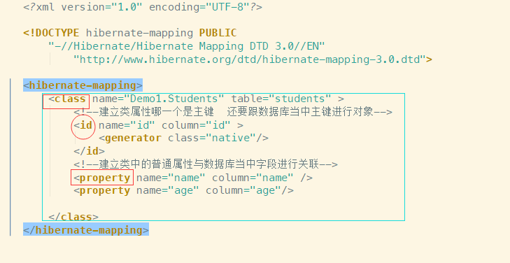
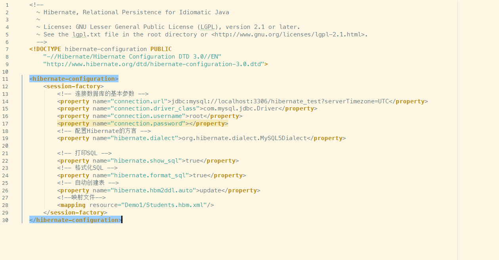

### #工程创建

1. 导包
	- 必须依赖的包`hibernate-release-5.3.1.Final\lib\required`
	- 数据库包
	- c3p0连接池`c3p0.jar`
	- 单元测试`junit-4.9.jar`


2. 建表
3. 创建Hibernate核心配置文件`hibernate.cfg.xml`
```
<hibernate-configuration>
	<session-factory>
		<!-- 连接数据库的基本参数 -->
		<property name="connection.url">jdbc:mysql://localhost:3306/hibernate_test?serverTimezone=UTC</property>
		<property name="connection.driver_class">com.mysql.jdbc.Driver</property>
		<property name="connection.username">root</property>
		<property name="connection.password"></property>
		<!-- 配置Hibernate的方言 -->
		<property name="hibernate.dialect">org.hibernate.dialect.MySQL5Dialect</property>

		<!-- 打印SQL -->
		<property name="hibernate.show_sql">true</property>
		<!-- 格式化SQL -->
		<property name="hibernate.format_sql">true</property>
		<!-- 自动创建表 -->
		<property name="hibernate.hbm2ddl.auto">update</property>
		<mapping resource="Demo1/Students.hbm.xml"/>
	</session-factory>
</hibernate-configuration>
```

4. 创建映射关系
	- xml
	- 命名 类名.hbm.xml
```
<?xml version="1.0" encoding="UTF-8"?>

<!DOCTYPE hibernate-mapping PUBLIC
    "-//Hibernate/Hibernate Mapping DTD 3.0//EN"
        "http://www.hibernate.org/dtd/hibernate-mapping-3.0.dtd">

<hibernate-mapping>
    <class name="Demo1.Students" table="students" >
        <!--建立类属性哪一个是主键  还要跟数据库当中主键进行对象-->
        <id name="id" column="id" >
            <generator class="native"/>
        </id>
        <!--建立类中的普通属性与数据库当中字段进行关联-->
        <property name="name" column="name" />
        <property name="age" column="age"/>

    </class>
</hibernate-mapping>
```

5. 测试-创建类执行
```java
package Demo1;

import org.hibernate.Session;
import org.hibernate.SessionFactory;
import org.hibernate.Transaction;
import org.hibernate.cfg.Configuration;

public class Test {
    @org.junit.Test
    public void Test()
    {
        //1. 加载Hibernate核心配置文件
        Configuration configure = new Configuration().configure(); //就去找配置文件

        //2. 创建sessionFactory
        SessionFactory sessionFactory = configure.buildSessionFactory();
        //3. 获取session
        Session session = sessionFactory.openSession();

        Students su = new Students();
        su.setName("Tahsi");
        su.setAge(18);
        su.setId(3);

        //4. 保存
        session.save(su);

        //5. 释放
        session.close();
        sessionFactory.close();
    }
}

```


### 补充

---

**第一步：**
    检查数据库的驱动，例如：mysql-connector-java-5.1.45-bin.jar

**第二步：**
    检查xml配置文件--5个必要
```
<property name="hibernate.connection.driver_class">com.mysql.jdbc.Driver</property>
  <property name="hibernate.connection.url">jdbc:mysql:///hibernate</property>
  <property name="hibernate.connection.username">root</property>
  <property name="hibernate.connection.password">123</property>
  
  <!-- 数据库的方言 -->
  <property name="hibernate.dialect">org.hibernate.dialect.MySQLDialect</property>
```

**第三步：**
    换成新版方言：`org.hibernate.dialect.MySQL5Dialect`

**第四步：**
    在url后加上`?serverTimeZone=UTC`，例：`<property name="hibernate.connection.url">jdbc:mysql:///hibernate?serverTimeZone=UTC</property>`


### #配置解析[映射配置]

---



**Class标签**建立类与表的映射关系

- name 类的全路径
- table 表名
- catalog

**ID标签**建立类的属性与表的主键对应关系

- name 
- column
- length
- type 

**property**建立普通属性与表中字段的对应关系

- name
- column

### #配置解析[核心配置]



**必须配置**

```
		<!-- 连接数据库的基本参数 -->
		<property name="connection.url">jdbc:mysql://localhost:3306/hibernate_test?serverTimezone=UTC</property>
		<property name="connection.driver_class">com.mysql.jdbc.Driver</property>
		<property name="connection.username">root</property>
		<property name="connection.password"></property>
		<!-- 配置Hibernate的方言 -->
		<property name="hibernate.dialect">org.hibernate.dialect.MySQL5Dialect</property>
```

### #配置本地DTD


--- 

`File -> Settings -> Sehemas and DTD`

### #配置连接池


1. 导入Jar包`hibernate-release-5.4.1.Final\lib\optional\c3p0`
2. 添加配置信息
```xml
 		<!--C3PO-->
        <property name="connection.provider_class">org.hibernate.c3p0.internal.C3P0ConnectionProvider</property>
        <!--在连接池中可用的数据库连接的最少数目 -->
        <property name="c3p0.min_size">5</property>
        <!--在连接池中所有数据库连接的最大数目  -->
        <property name="c3p0.max_size">20</property>
        <!--设定数据库连接的过期时间,以秒为单位,
        如果连接池中的某个数据库连接处于空闲状态的时间超过了timeout时间,就会从连接池中清除 -->
        <property name="c3p0.timeout">120</property>
        <!--每3000秒检查所有连接池中的空闲连接 以秒为单位-->
        <property name="c3p0.idle_test_period">3000</property>
        <!--设置事务的隔离级别-->
        <property name="hibernate.connection.isolation">4</property>
        <!--创建一个session绑定到当前线程-->
        <property name="current_session_context_class">thread</property>
```

```xml
<!DOCTYPE hibernate-configuration PUBLIC
		"-//Hibernate/Hibernate Configuration DTD 3.0//EN"
		"http://www.hibernate.org/dtd/hibernate-configuration-3.0.dtd">

<hibernate-configuration>
	<session-factory>
		<!-- 连接数据库的基本参数 -->
		<property name="hibernate.connection.driver_class">com.mysql.jdbc.Driver</property>
		<property name="hibernate.connection.url">jdbc:mysql:///hibernate</property>
		<property name="hibernate.connection.username">root</property>
		<property name="hibernate.connection.password">1234</property>
		<!-- 配置Hibernate的方言 -->
		<property name="hibernate.dialect">org.hibernate.dialect.MySQL5Dialect</property>
		<!-- 打印SQL -->
		<property name="hibernate.show_sql">true</property>
		<!-- 格式化SQL -->
		<property name="hibernate.format_sql">true</property>
		<!-- 自动创建表 -->
		<property name="hibernate.hbm2ddl.auto">update</property>

		<!--C3PO-->
		<property name="connection.provider_class">org.hibernate.c3p0.internal.C3P0ConnectionProvider</property>
		<!--在连接池中可用的数据库连接的最少数目 -->
		<property name="c3p0.min_size">5</property>
		<!--在连接池中所有数据库连接的最大数目  -->
		<property name="c3p0.max_size">20</property>
		<!--设定数据库连接的过期时间,以秒为单位,
        如果连接池中的某个数据库连接处于空闲状态的时间超过了timeout时间,就会从连接池中清除 -->
		<property name="c3p0.timeout">120</property>
		<!--每3000秒检查所有连接池中的空闲连接 以秒为单位-->
		<property name="c3p0.idle_test_period">3000</property>
		<!--设置事务的隔离级别-->
		<property name="hibernate.connection.isolation">4</property>
		<!--创建一个session绑定到当前线程-->
		<property name="current_session_context_class">thread</property>
		<!--加载映射文件-->
		<mapping resource="com/myxq/domain/Customer.hbm.xml"/>

	</session-factory>
</hibernate-configuration>
```


### #查看日志

---

1. 导包`log4j-1.2.16.jar`

2. 把log4j.preperties放到src下

输出源：

- console控制台
- file文件

级别：

- error
- warn
- info
- debug默认
- trace