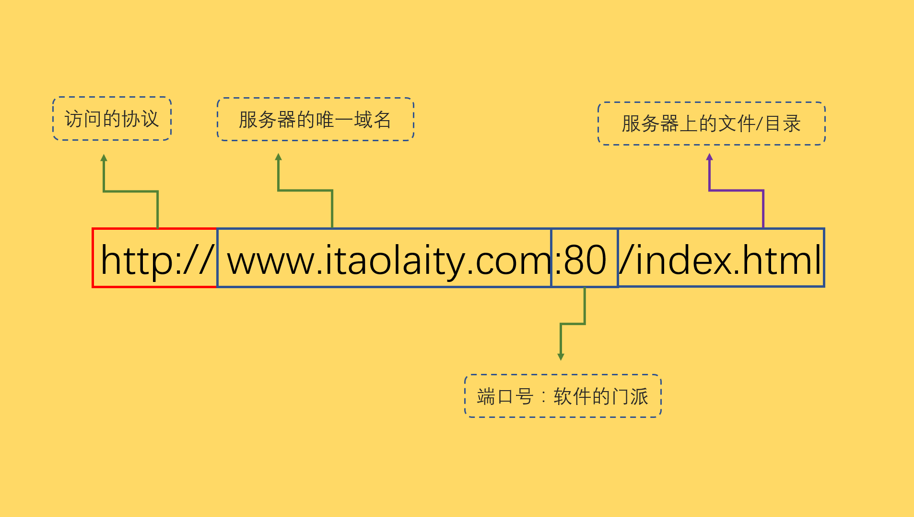
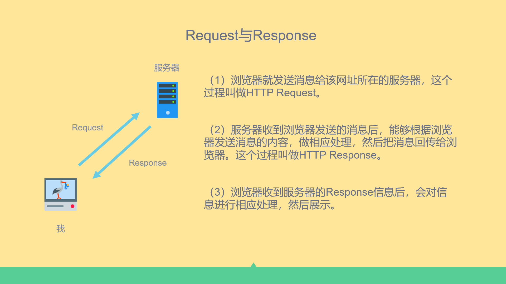
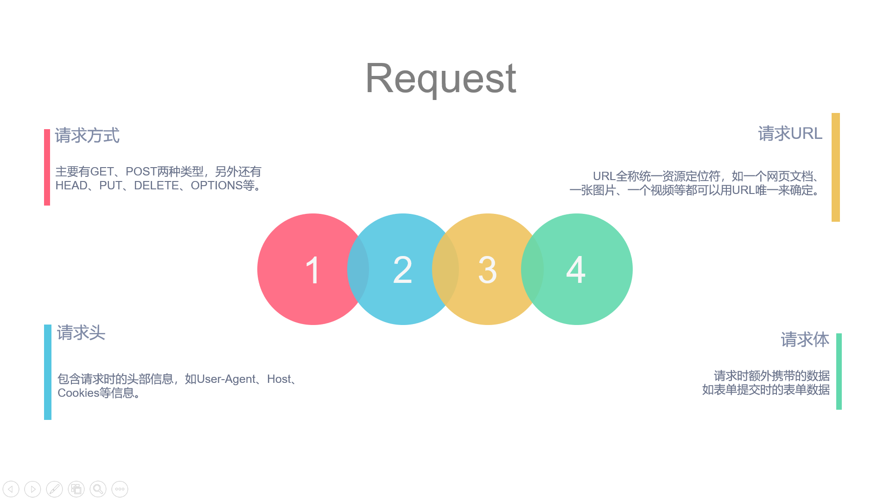
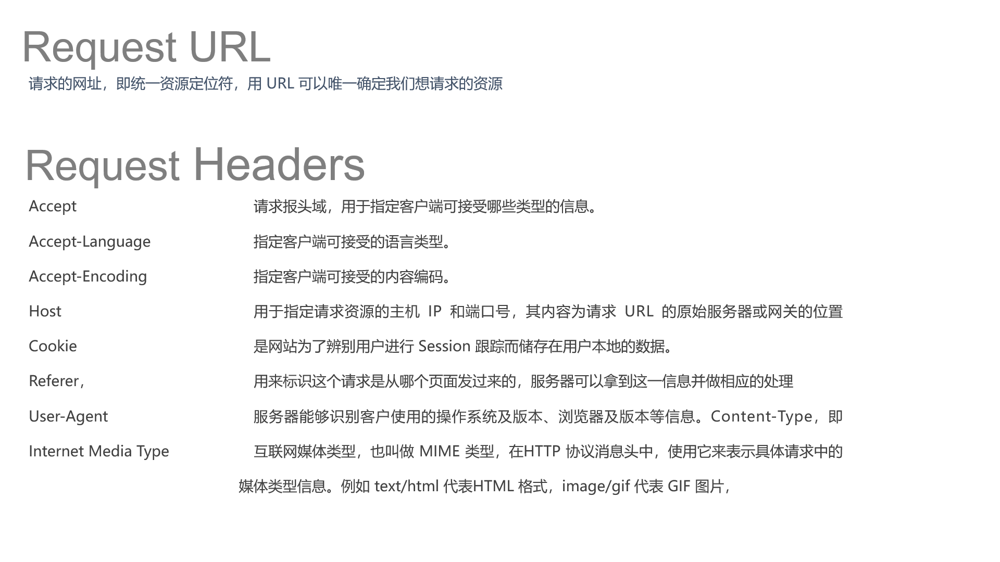
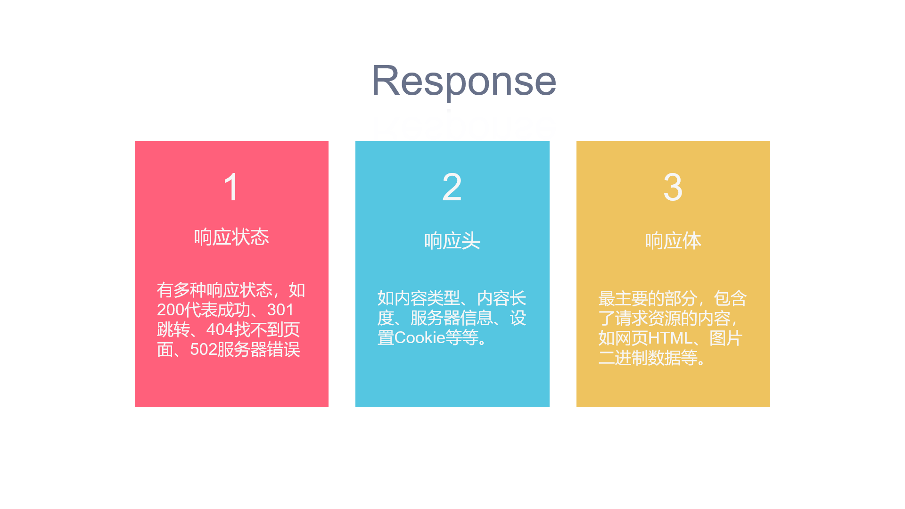
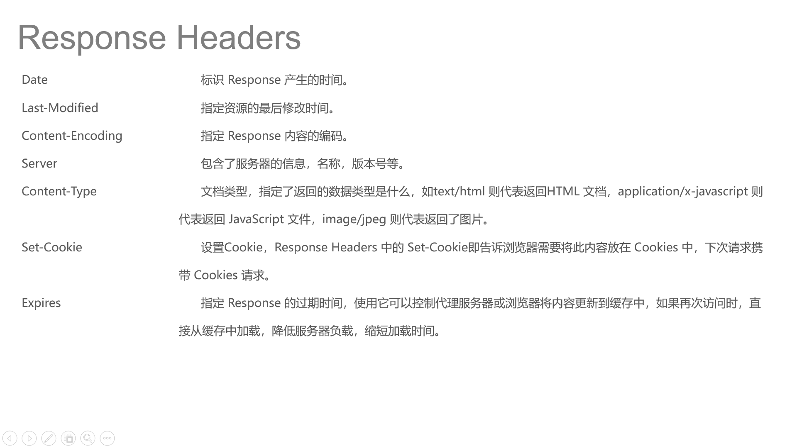
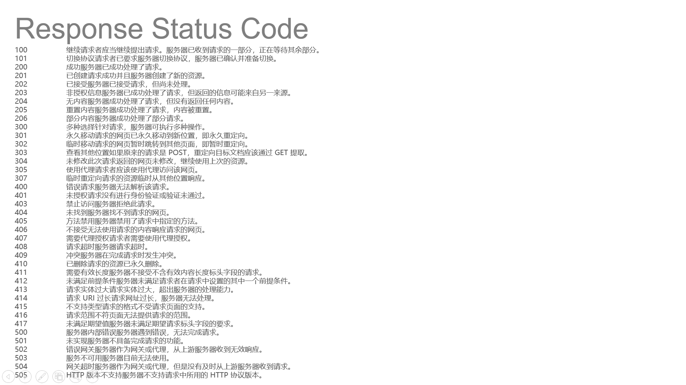

<style type="text/css">
	h1 {

		font-weight: 400;
	}
	img {
		border-radius: 10px;
		box-shadow: 0 2px 8px rgba(0,0,0,.3);
	}
	body {
		background-color: #FDF6E3;
/*		margin:0;
		outline:none;
		border:none;
		max-width: 100%;*/

	}
	import::before{
		display: inline-block;
		content: "";
		width: 10px;
		height: 10px;
		background-color: red;
		margin-right: 10px;
		border-radius: 50%;
	}
	import {
		font-size:14px;
		font-weight: bold;
		padding:0.55rem;
		border-radius:5px; 
		color:#eb5055;
	}
	.markdown-body blockquote{
		border-left: 4px solid tomato;
	}
</style>

# <center>客户端与服务器</center>

> ### 分类

- BS    Browser/Server(浏览器/服务器架构)

    - 特点：基于浏览器访问的应用，把业务层交给服务器来完成，客户端仅仅做界面的渲染和数据的交换
    - 优点：只开发服务器端，可以跨平台、移植性很强
    - 缺点：安全性比较低，用户体验较差

- CS    Client/Server(PC客户端、服务器架构)
    - 特点：在服务器当中就主要是一个数据库，把所有的业务逻辑以及界面都交给客户端完成
    - 优点：较为安全，用户界面丰富，用户体验好
    - 缺点：每次升级都要重新安装，针对于不同的操作系统开发，可移植性差


> ### Web资源

什么是Web？

WEB网页，它用于表示网络主机上供外界访问的资源。

URL地址

```
协议：//主机地址：端口号/资源地址
```



> ### 资源访问流程

<import>当我们在浏览器当中访问一个网站的时候，为什么就能看到一个页面？</import>

一个网址对应的其实是一个IP地址，一个IP地址对应一台电脑，通过IP地址找到对应的电脑，电脑当中安装的有Web服务器，通过端口号找到对应的服务器

找到了对应的服务器，服务器就会把页面返回给你（注意 HTTP是无状态的请求）


注意

IP地址找对应的电脑用到了DNS域名解析，作用是将域名与IP地址相互转换，在发起请求的时候我们的计算机会优先在（C:\Windows\System32\drivers\etc\host）这个文件夹里访问，一旦找到会立即打开相应的网站没有找到才会提交DNS服务器进行IP解析


# <center>HTTP协议</center>
- **HTTP协议用于客户端和服务器端之间的通信**
- **通过请求和响应的交换达成通信**
- **HTTP是不保存状态的协议**

> URI 统一资源标识符

> URL 统一资源定位符

### 请求与响应

### 请求

### 请求头

### 响应

### 响应头

### 响应状态码

**状态码类别**
- 1XX 信息性状态码
- 2XX 成功状态码
- 3XX 重定向状态码
- 4XX 客户端错误状态码
- 5XX 服务器错误状态码


  > ### 请求与相应

- 请求get
	- 把客户端请求发送给服务器
	- 请求的方式
		- 通过浏览器的地址栏
		- 通过html当中的form表单
		- 通过a链接的href
		- src属性
- 响应post
	- 服务器把你要的数据发送给客户端


> ### Get与Post

- ####Get

GET 方法向页面请求发送参数；

地址和参数信息中间用 ? 字符分隔

查询字符串会显示在地址栏的URL中，不安全，请不要使用GET请求提交敏感数据

GET 方法有大小限制：请求字符串中最多只能有 1024 个字符

GET请求能够被缓存

GET请求会保存在浏览器的浏览记录中

可以添加书签

编码类型为application/x-www-form-urlencoded

只允许ASCII字符类型，不能用二进制流

点击刷新时，不会有反应

GET请求主要用以获取数据

- #### Post

POST 方法向页面请求发送参数

使用POST方法时，查询字符串在POST信息中单独存在，和HTTP请求一起发送到服务器

编码类型为：application/x-www-form-urlencoded or multipart/form-data. 请为二进制数据使用multipart编码

没有历史记录

参数类型没有限制，可以是字符串也可以是二进制流

数据不会显示在地址栏中，也不会缓存下来或保存在浏览记录中，所以看POST求情比GET请求安全，但也不是最安全的方式。如需要传送敏感数据，请使用加密方式传输

查询字符串不会显示在地址栏中

Post传输的数据量大，可以达到2M，而Get方法由于受到URL长度限制,只能传递大约1024字节. 

Post就是为了将数据传送到服务器段，Get就是为了从服务器段取得数据