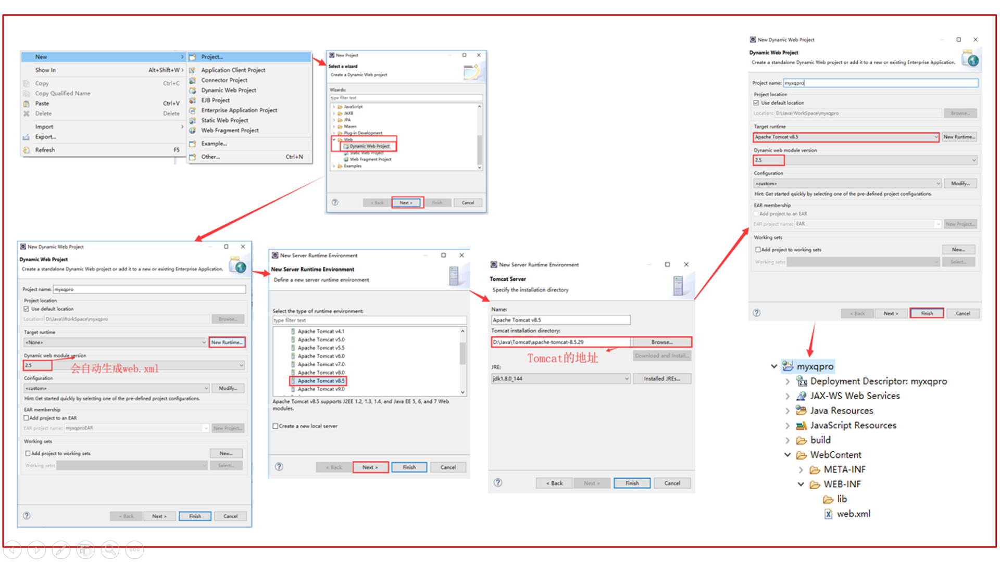
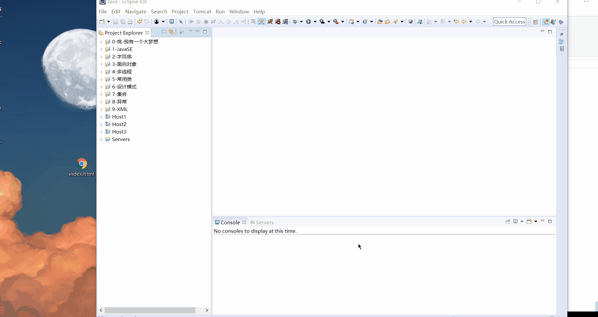
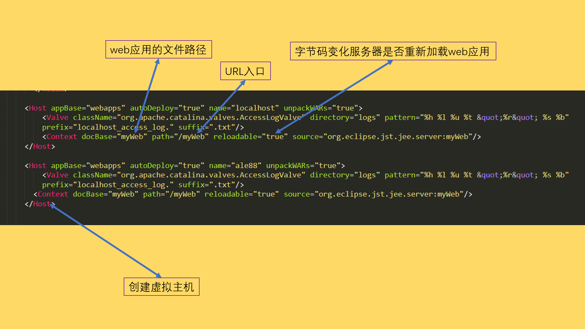
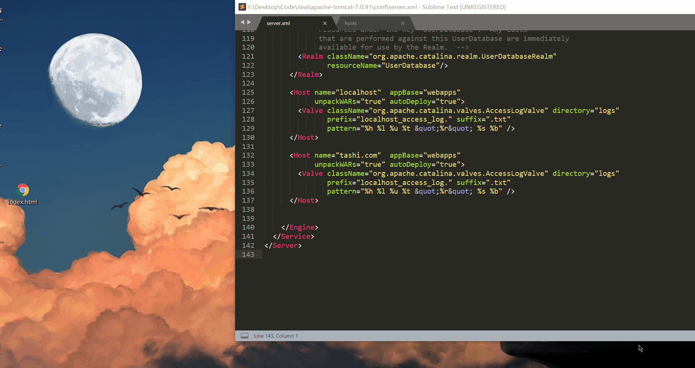

<style type="text/css">
	h1 {

		font-weight: 400;
	}
	img {
		border-radius: 10px;
		box-shadow: 0 2px 8px rgba(0,0,0,.3);
	}
	body {
		background-color: #FDF6E3;
/*		margin:0;
		outline:none;
		border:none;
		max-width: 100%;*/

	}
	import::before{
		display: inline-block;
		content: "";
		width: 10px;
		height: 10px;
		background-color: red;
		margin-right: 10px;
		border-radius: 50%;
	}
	import {
		font-size:14px;
		font-weight: bold;
		padding:0.55rem;
		border-radius:5px; 
		color:#eb5055;
	}
	.markdown-body blockquote{
		border-left: 4px solid tomato;
	}
</style>


# <center>Tomcat服务器</center>


## [创建WEB应用]
1. 新建一个Dynamic Web Project
2. 添写工程名称，选择tomcat服务器
3. 选择部署版本为2.5，会自带web.xml。完成finash

4. 在服务器调出servers窗口。Windows-Preferences-Servers
5. 配置服务器。
6. 发布Web工程。


搭建工作可以说是非常轻松的了。下面介绍一下Tomcat服务器的**体系结构**

> # 知其然知其所以然

## [tomcat服务器体系结构]
#### [1.Server]
整个Servlet容器组合，可以包含一个或多个<Service>

#### [2.service]
它由一个或者多个Connector组成，以及一个Engine，负责处理所有Connector所获得的客户请求。

#### [3.Connector]
客户端与程序交互组件,负责接收请求以及向客户端返回响应。

#### [4.Engine]
处理连接器接收到请求

#### [5.Context]
一个Context对应于一个Web Application

docBase  web应用的文件路径

path    URL入口

reloadable  字节码变化服务器是否重新加载web应用
#### [文件结构]





#### [6.Host]
虚拟主机

1. 输入网址时， 就会先到host文件当中查找有没有对应的IP地址，如何有就直接访问该IP地址
2. 如果没有，就会到外网去找DNS服务器进行域名与IP地址的解析，查找
3. 多个域名可以访问同一个IP
4. 一个IP对应一台电脑

---


> ### 通过域名访问Web站点

- 添加域名至C:\Windows\System32\drivers\etc\Hosts文件里
- 修改conf\server.xml



> # [一台机器部署多个Tomcat服务]

1. **修改端口**

在Tomcat的conf/server.xml文件 修改一下端口信息
```
<Server port="8006" shutdown="SHUTDOWN"> (原来是8005) 
<Connector port="8090" protocol="HTTP/1.1" connectionTimeout="20000" redirectPort="8443" /> (原来是8080)
<Connector port="8089" protocol="AJP/1.3" redirectPort="8443" /> (原来是8009)
```

2. **修改startup.bat**
  - 增加环境变量CATALINA_HOME_2,值为新的Tomcat的地址

  - 增加环境变量CATALINA_BASE_2,值为新的Tomcat的地址

  - 修改新的Tomcat的startup.bat 把CATALINA_HOME替换CATALINA_HOME_2

  - 文件开头加上SET JAVA_HOME=(JDK所在路径)

  - 修改新的Tomcat的catalina.bat,把CATALINA_HOME替换CATALINA_HOME_2再把CATALINA_BASE改为CATALINA_BASE_2


3. **修改shutdown.bat**
  - CATALINA_HOME替换为CATALINA_HOME_2


可以看到我们在浏览器输入不同的域名就可以获取不同的页面


### 查看端口占用
```
查看所有端口信息
netstat -a
```
```
查看端口占用

netstat -aon|findstr "8080"
```
### 关闭进程
> 按进程号关闭进程

```
taskkill /pid 8080
```
```
taskkill /pid 77 /pid 90
```
> 按进程名关闭进程

```
taskkill /im mspaint.exe
```
```
关闭所有应用程序
taskkill /im *.exe
```
> 有提示的关闭进程

```
taskkill /t /im mspaint.exe
taskkill /t /pid 3552
```


  [1]: http://www.itaolaity.com/usr/uploads/2018/10/3247974268.png
  [2]: http://www.itaolaity.com/usr/uploads/2018/10/2775638483.gif
  [3]: http://www.itaolaity.com/usr/uploads/2018/10/3671231984.png
  [4]: http://www.itaolaity.com/usr/uploads/2018/10/1145065126.png
  [5]: http://www.itaolaity.com/usr/uploads/2018/10/2575921623.gif
  [6]: http://www.itaolaity.com/usr/uploads/2018/10/3525118707.png