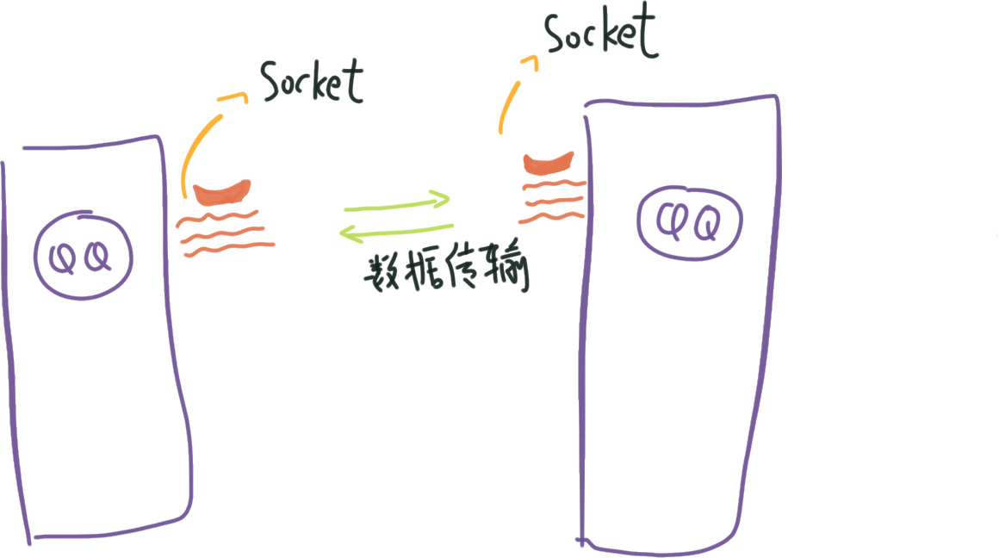
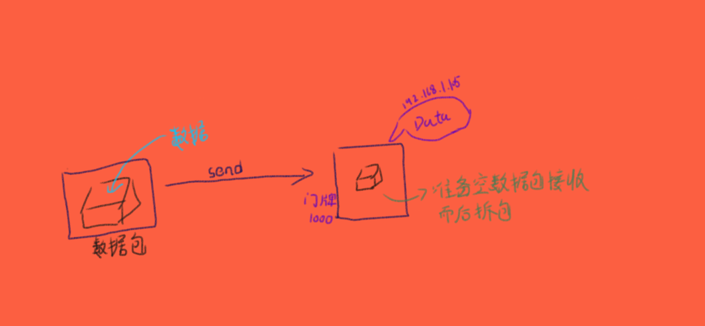
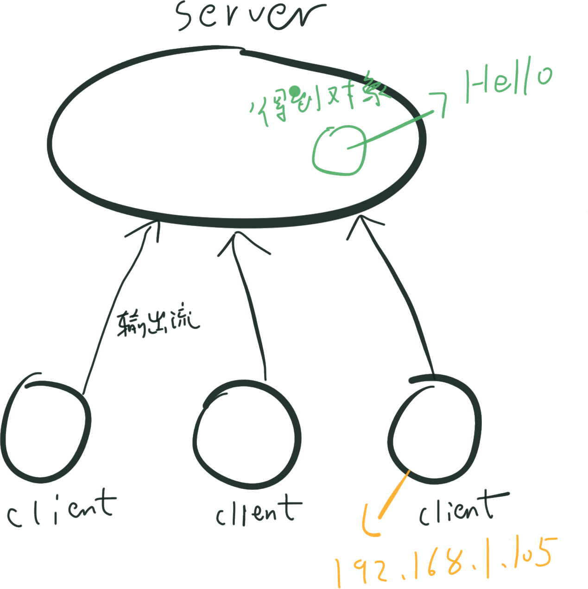

# TCP与UDP

**UDP**

- 数据以及源和目的地封装在数据包中，不需要建立连接
- 每个数据报的大小在限制在64K内
- 无连接所以是不可靠协议
- 无连接所以速度快

**TCP**

- 建立连接，形成传输数据的通道
- 在连接中进行大数据量的传输
- 通过三次握手完成连接，是可靠协议
- 必须连接，所以速度慢


### Socket

Socket就是为网络服务提供的一种机制

通信的两端都有Socket

网络通信就是Socket之间的通信

数据在两个Socket间通过IO传输




# UDP

**包**

##### `DatagramPacket`  `DatagramSocket`

**发送端**

1. 建立发送端，接收端

2. 建立数据包

3. 调用Socket的发送接受方法

4. 关闭Socket

```java

import java.net.DatagramPacket;
import java.net.DatagramSocket;
import java.net.InetAddress;

public class Send {
    public static void main(String[] args) throws Exception{
        /*1. 建立UDP Socket服务*/
        DatagramSocket ds = new DatagramSocket();

        /*2. 提供数据，并将数据封装到数据包中*/
        byte[] data = "Aha is comming!".getBytes();
        DatagramPacket dp = new DatagramPacket(data, data.length, InetAddress.getLocalHost(), 1000);

        /*3. 通过Socket服务的发送功能，将数据包发送出去*/
        ds.send(dp);

        /*4. 关闭资源*/
        ds.close();
    }

}
```

**接受端**

1. 定义UDP Socket服务， 监听端口。

2. 定义数据包， 存储收到的字节数据

3. Socket的`receive`方法 接受数据存入数据包

4. 取出数据

5. 关闭资源

```java
import java.net.DatagramPacket;
import java.net.DatagramSocket;

public class Receive {
    public static void main(String[] args)throws Exception{
        /*建立端点服务*/
        DatagramSocket ds = new DatagramSocket(1000);

        /*定义数据包*/
        byte[] data = new byte[1024];
        DatagramPacket dp = new DatagramPacket(data, data.length);

        /*存入数据包*/
        ds.receive(dp);

        /*获取其中的数据*/
        String ip = dp.getAddress().getHostAddress();
        String res = new String(dp.getData(), 0, dp.getLength());
        int port = dp.getPort();

        System.out.println(ip+ "---" + res+ "---" +port);

        /*关闭资源*/
        ds.close();
    }
}
```

##### `192.168.1.105---Aha is comming!---6666`





**通过键盘录入的方式实现发送与接受**

```java
import java.io.BufferedReader;
import java.io.InputStreamReader;
import java.net.DatagramPacket;
import java.net.DatagramSocket;
import java.net.InetAddress;

public class Send {
    public static void main(String[] args)throws Exception{
        /*Socket服务*/
        DatagramSocket ds = new DatagramSocket();

        BufferedReader bufr = new BufferedReader(new InputStreamReader(System.in));
        String line = null;
        while((line=bufr.readLine())!=null){
            if("886".equals(line))
                break;
            byte[] data = line.getBytes();
            DatagramPacket dp = new DatagramPacket(data, data.length, InetAddress.getLocalHost(), 10001);
            ds.send(dp);
        }
        ds.close();
    }
}

import java.net.DatagramPacket;
import java.net.DatagramSocket;

public class Receive {
    public static void main(String[] args)throws  Exception{
        DatagramSocket ds = new DatagramSocket(10001);

        while(true){
            byte[] buf = new byte[1024];
            DatagramPacket dp = new DatagramPacket(buf, buf.length);

            ds.receive(dp);

            String ip = dp.getAddress().getHostAddress();
            String data = new String(dp.getData(), 0 , dp.getLength());
            int port = dp.getPort();

            System.out.println(ip+"---"+data+"----"+port);
        }
    }
}
```

**多线程控制接受与发送**

```java
import java.io.BufferedReader;
import java.io.InputStreamReader;
import java.net.DatagramPacket;
import java.net.DatagramSocket;
import java.net.InetAddress;

/*
* 一个线程控制收 一个线程控制发
* */
public class 聊天 {
    public static void main(String[] args)throws Exception{
        DatagramSocket sendSocket = new DatagramSocket();
        DatagramSocket recSocket = new DatagramSocket(10002);

        new Thread(new Send(sendSocket)).start();
        new Thread(new Rece(recSocket)).start();
    }
}
/*发送端*/
class Send implements Runnable{
    private DatagramSocket ds;
    public Send(DatagramSocket ds){
        this.ds = ds;
    }
    public void run(){
        try{
            BufferedReader bufr = new BufferedReader(new InputStreamReader(System.in));
            String line = null;
            while((line=bufr.readLine())!=null){
                if("886".equals(line)){
                    break;
                }
                byte[] buf = line.getBytes(); /*字符串转换Byte*/
                /*数据打包*/
                DatagramPacket dp = new DatagramPacket(buf, buf.length, InetAddress.getLocalHost(), 10002);
                ds.send(dp); /*发送*/
            }
        }catch (Exception e){
            e.printStackTrace();
        }finally{
            ds.close();
        }
    }
}


class Rece implements Runnable{
    private DatagramSocket ds;
    public Rece(DatagramSocket ds){ /*构造方法*/
        this.ds = ds;
    }
    public void run(){
        try{
            while(true){
                byte[] buf = new byte[1024];
                DatagramPacket dp = new DatagramPacket(buf, buf.length);/*空盒子*/
                /*收数据*/
                ds.receive(dp);

                String ip = dp.getAddress().getHostAddress();
                String data = new String(dp.getData(), 0 , dp.getLength());
                int port = dp.getPort();

                System.out.println(ip+"---"+data+"----"+port);
            }
        }catch(Exception e){
            e.printStackTrace();
        }finally{
            ds.close();
        }
    }
}
```


# TCP

TCP分客户端与服务端

客户端对应的对象是Socket

服务端对应的对象是ServerSocket


**客户端**

1. 创建Socket服务 指定连接的主机和端口
2. 发送数据
3. 关闭连接

```java

import java.io.OutputStream;
import java.net.Socket;

public class Client {
    public static void main(String[] args)throws Exception{
        Socket s = new Socket("192.168.1.105", 6666);

        /*发送数据*/
        OutputStream out = s.getOutputStream();
        out.write("Hello".getBytes());

        s.close();
    }
}
```


**服务端**

1. 建立服务端的Socket服务 并监听端口
2. 获取连接过来的客户端对象
3. 获取读取流来的数据
4. 关闭服务端

```java
import java.io.InputStream;
import java.net.ServerSocket;
import java.net.Socket;

public class Server {
    public static void main(String[] args)throws Exception{
        /*建立服务端的Socket服务 并监听端口*/
        ServerSocket ss = new ServerSocket(6666);

        /*获取连接过来的客户端对象 阻塞式方式 没有连接就会等*/
        Socket s = ss.accept();

        String ip = s.getInetAddress().getHostAddress();
        System.out.println(ip);

        /*获取读取流来的数据*/
        InputStream in  = s.getInputStream();

        byte[] buf = new byte[1024];
        int len = in.read(buf);

        System.out.println(new String(buf, 0, len));
        /*关闭服务端*/

        ss.close();

    }
}
```




