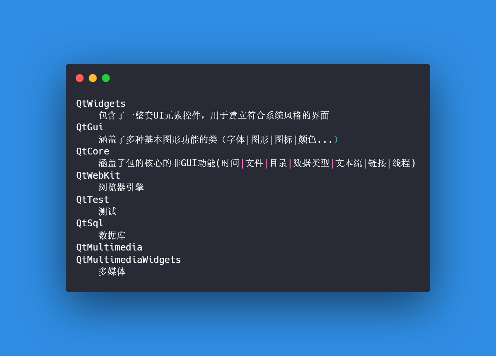

# Python中哪些库可以支持GUI编程

`Graphical User Interface`，简称 GUI

- 官方标准库 Tkinter

- PyQT, PySide，wxPython，PyGUI，Kivy，Libavg


### #辅助参考

将UI文件转换PY文件之后添加如下代码即可运行


```python
import sys
from PyQt5 import QtWidgets

if __name__ == "__main__":

	app = QtWidgets.QApplication(sys.argv) # 所有的PyQT5的应用必须创建一个应用(Application)对象。

	MainWindow = QtWidgets.QMainWindow()

	ui = Ui_Form() #实例一个对象

	ui.setupUi(MainWindow)

	MainWindow.show()

	sys.exit(app.exec_())
```


### #使用Pyqt5的Api文档

```python
from PyQt5.QtWidgets import QWidget
dir(QWidget)

help(QWidget)
```

### #PyQT5的库结构



### #布局管理

- 垂直布局
- 水平布局
- 栅格布局
- 网格布局
- 绝对布局

### #程序结构


> 解释

1. 一个Pyqt程序需要一个应用程序对象
	- 它包含主事件循环，在其中来自窗口系统和其它资源的所有事件被处理和调度
	- 它也处理应用程序的初始化和结束，并且提供对话管理
	- 它也处理绝大多数系统范围和应用程序范围的设置

2. `app.exec_()`意思是让程序进入主循环，不要停止

3. 一个没有父对象控件默认不显示，必须要调用show()才可以
4. 一个应用程序中可以显示多个顶级控件
