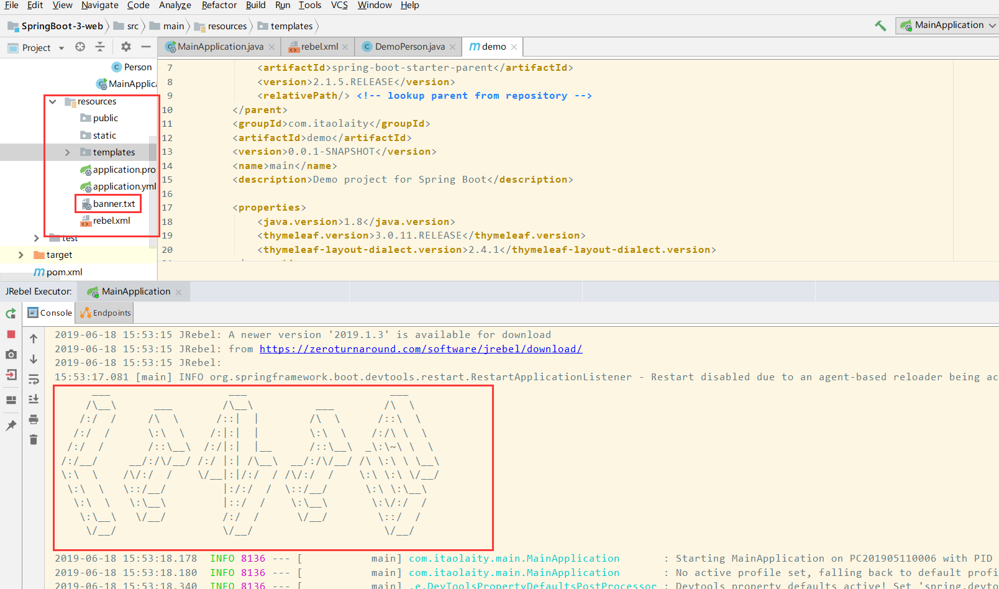

> ### 定制Banner

SpringBoot启动时会打印一个Banner


然后我们可以自定义

1. resource目录下创建banner.txt文件
2. 艺术字体
   - <https://www.bootschool.net/ascii>
   - <http://www.network-science.de/ascii/>




# 配置文件

- application.properties
- application.yml

#### Tomcat配置

```xml
server.port=8088 #配置Web容器的端口号
server.error.path=/error #当项目出错跳转页面
server.servlet.session.timeout=30m #Session失效时间 m(表分钟)
server.servlet.context-path=/chcc #项目名称
server.tomcat.uri-encoding=utf-8 #Tomcat请求编码
server.tomcat.max-threads=5OO #最大线程数
server.tomcat.basedir=/home/tmp #运行日志和临时文件的目录
```

## yml

YAML A Markup Language 是一个标记语言

YAML以数据为中心的配置文件

```yml
server:
	port: 8888
```


### 基本语法

1. `key: value`表示一对键值 （:后面有一个空格）
2. 以空格的缩进控制层级关系
3. 属性和值是大小写敏感的

### 值的写法

1. **字符串**

   1. 双引号：不会转义字符串里面的特殊字符
   2. 单引号：会转义特殊字符输入什么输出什么

2. **对象**

   ​	在下一行来写对象的属性与值

   ```yaml
   person:
   	name: Tony
   	age: 18
   ```

   ```yaml
   person: {name: Tony,age: 18}
   ```

3. **数组**

   用`-`表示数组中的一个元素

   ```yaml
   pest:
   	- dog
   	- cat
   	- tiger
   ```

   ```yaml
   pets: [dog, cat, tiger]
   ```

   

   **Demo**

   `application.yml`
   
   ```yaml
   person:
     name: Tony
     sex: 男
     pets:
       - dog
       - cat
       - tiger
    age: 18
   ```

   对应的javaBean`Person.java`
   
   ```java
   /**
    *  配置文件中配置的每一个属性 与组件映射
    *  @ConfigurationProperties
   		perfix属性描述了要加载的配置文件的前缀
    * */
   @ConfigurationProperties(prefix = "person")
   public class Person {
       private String name;
       private Integer age;
       private String sex;
       private String[] pets;
   
       public String getName() {
           return name;
       }
   
       public void setName(String name) {
           this.name = name;
       }
   
       public Integer getAge() {
           return age;
       }
   
       public void setAge(Integer age) {
           this.age = age;
       }
   
       public String getSex() {
           return sex;
       }
   
       public void setSex(String sex) {
           this.sex = sex;
       }
   
       public String[] getPets() {
           return pets;
       }
   
       public void setPets(String[] pets) {
           this.pets = pets;
       }
   
       @Override
       public String toString() {
           return "Person{" +
                   "name='" + name + '\'' +
                   ", age=" + age +
                   ", sex='" + sex + '\'' +
                   ", pets=" + Arrays.toString(pets) +
                   '}';
    }
   }
   ```
   

```xml
<!--导入配置文件处理器-->
<dependency>
    <groupId>org.springframework.boot</groupId>
    <artifactId>spring-boot-configuration-processor</artifactId>
    <optional>true</optional>
</dependency>
```

```java
@RestController
public class Test {
    @Autowired
    Person per;

    @GetMapping("/per")
    public String per(){
        return per.toString();
    }
}
```

   


## Properties配置

```xml
person.name=张三
person.age=18
person.sex=男
person.pets=dog,cat,tiger
```

   

   > ###  @ConfigurationProperties

   批量注入配置文件中的属性

   

   1. 支持松散绑定

   first-name <==> firstName

   2. 不支持SqEL表达式
   
   3. 支持JSR303数据校验

   

   

   > ### @PropertySource(value={“classpath:filePath”})

   加载指定的配置文件

   

   > ### ImportResource 

   导入Spring的配置文件，让配置文件里面的内容生效

   

   ```java
   @ImportResource(locations={"classpath:filePath.xml"})
   导入Spring的配置文件让其生效
   ```

   

   ## 配置文件占位符

   

   **属性占位符**

   占位符获取之前的配置值，还可以用`:`指定默认值

   ```properties
   person.name=张三
   person.uname=${person.name} //张三
   ```

   **随机数**

   ```properties
   person.uuid=${random.uuid} //随机uuid
   person.age=${random.int} //随机int数
   ```

   - random.value
   - random.int
   - random.long
   - random.int(10)
   - random.int[5,100]

   

   ## Profile

   

   指定运行环境

   

   **多个文件**

   1. application.dev.yml (开发环境)
   2. application.yml
   3. application.prod.yml(生产环境)

   **激活|选择环境**

   properties

   ```yml
   spring.profiles.active=dev
   ```

   yml 

   通过active快速选择

   ```yml
   spring:
     profiles:
       active: prod
   ---
   server:
     port: 8081
   spring:
     profiles: dev
   ---
   server:
     port: 8888
   spring:
     profiles: prod
   ```

   

   

   ## 配置文件加载顺序

   默认的配置文件是application.properties 或者application.yml 文件作为默认配置文件

   

   **优先级**由高到低

   ```
   1. 当前项目下的config/file.yml
   2. 当前项目下的file.yml
   3. resource目录下的config/file.yml
   4. resource目录下的file.yml
   ```

   高优先级的会覆盖低优先级的配置，而且配置会形成互补配置

   

   ## 外部配置加载顺序

   

   1. **命令行加载**

   多个配置用空格分隔

   ```bash
   java -jar ....jar  --server.port=8888
   ```

   

   

   

   