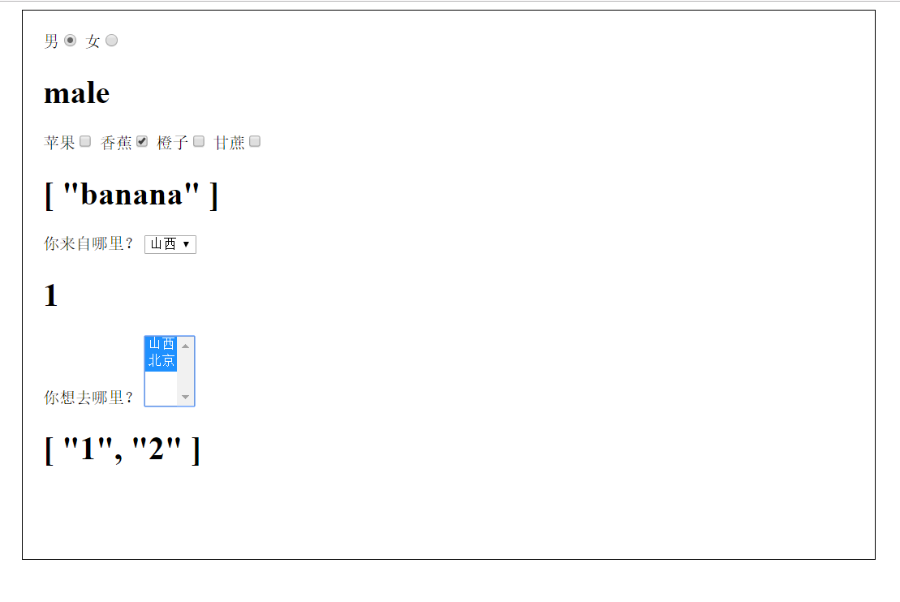

### #表单

- `v-model` 指令在表单 `<input>、<textarea>` 及 `<select>` 元素上创建双向数据绑定

**修饰符**

- `.lazy`非实时更新
- `.number`输入值转为数值类型
- `.trim`过滤首尾空白字符
```js
<input v-model.trim="msg">
```

```html
<div id="app">

    <label>男<input v-model="sex" value="male" type="radio"></label>
    <label>女<input v-model="sex" value="female" type="radio"></label>
    <h1>{{sex}}</h1>

    <label>苹果<input v-model="fruit" value="apple" type="checkbox"></label>
    <label>香蕉<input v-model="fruit" value="banana" type="checkbox"></label>
    <label>橙子<input v-model="fruit" value="orange" type="checkbox"></label>
    <label>甘蔗<input v-model="fruit" value="sugarcane" type="checkbox"></label>
    <h1>{{fruit}}</h1>

    你来自哪里？
    <select v-model="form">
        <option value="1">山西</option>
        <option value="2">北京</option>
    </select>
    <h1>{{form}}</h1>

    你想去哪里？
    <select v-model="dest" multiple>
        <option value="1">山西</option>
        <option value="2">北京</option>
    </select>
    <h1>{{dest}}</h1>
</div>

<script src="../Vue/js/Vue.js"></script>
<script>
    var app = new Vue({
        el:'#app',
        data:{
            sex:null,
            fruit:[],
            form:null,
            dest:[]
        }
    });
</script>
```



### #事件处理

- `v-on`

**监听事件**

```html
<!-- 点击弹出框 -->
<div id="app">
    <button v-on:click="clickFun">点击</button>
</div>


<script src="../Vue/js/Vue.js"></script>
<script>
    var app = new Vue({
        el: '#app',
        data: {//数据区域
           
        },
        methods:{//方法区域
        	 clickFun:function(){
                alert("我被点击了");
                alert(event.target.tagName);
            }

        }

    })
</script>
```

**处理函数**

不仅可以调用方法而且可以传递参数

```html
<button v-on:click="say('hi')">Say hi</button>
<button v-on:click="say('what')">Say what</button>
```

**修饰符**

- 默认行为`event.preventDefault()`
- 冒泡事件`event.stopPropagation()`
- `.stop`
- `.prevent`
- `.capture`
- `.self`
- `.once`
- `.passive`

```
<!-- 阻止单击事件继续传播 -->
<a v-on:click.stop="doThis"></a>

<!-- 提交事件不再重载页面 -->
<form v-on:submit.prevent="onSubmit"></form>

<!-- 修饰符可以串联 -->
<a v-on:click.stop.prevent="doThat"></a>

<!-- 只有修饰符 -->
<form v-on:submit.prevent></form>

<!-- 添加事件监听器时使用事件捕获模式 -->
<!-- 即元素自身触发的事件先在此处理，然后才交由内部元素进行处理 -->
<div v-on:click.capture="doThis">...</div>

<!-- 只当在 event.target 是当前元素自身时触发处理函数 -->
<!-- 即事件不是从内部元素触发的 -->
<div v-on:click.self="doThat">...</div>

<!-- 点击事件将只会触发一次 -->
<a v-on:click.once="doThis"></a>

<!-- 只有在 `key` 是 `Enter` 时调用 `vm.submit()` -->
<input v-on:keyup.enter="submit">
```


### #条件渲染

- `v-if`

```html
<h1 v-if="...">true执行的代码</h1>

<h1 v-else="...">false执行的代码</h1>
```

**注意** `v-else`必须紧跟`v-if`|`v-else-if`否则不会识别


- `v-show`

**区别**

1. `v-if`条件为真才会渲染 `v-show`总会渲染只不过控制元素的显示与隐藏
2. `v-if`更高的切换开销 `v-show`更高的初始渲染开销

### #列表渲染

- `v-for`

感觉有点类似与python语言的遍历

```html
<ul>
	<li v-for="item in items"></li>
</ul>
```


还可以添加索引

```html
<ul>
	<li v-for="(item, index) in items"></li>
</ul>
```


### #数组

- 变异方法
	- `push()` #添加
	- `pop()`#删除
	- `shift(start,end)` #数组的切片
	- `unshift()`#向数组的开头添加一个或更多元素，并返回新的长度
	- `splice(index, howmany)`#向/从数组中添加/删除项目，然后返回被删除的项目
	- `sort()`#排序
	- `reverse()`#颠倒数组中元素的顺序
```

顾名思义 就是数组动态添加或改变会触发视图的更新

- 非变异方法
	- `filter()`
	- `concat()`
	- `slice()`
