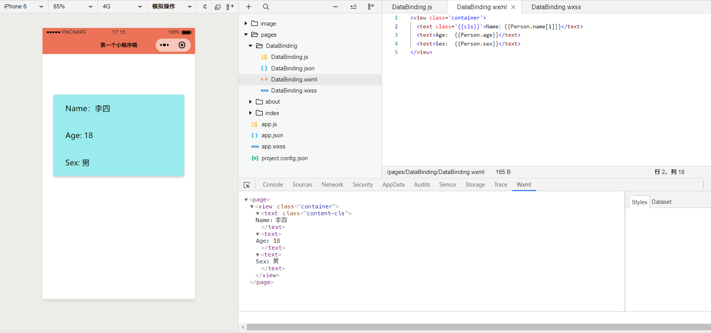
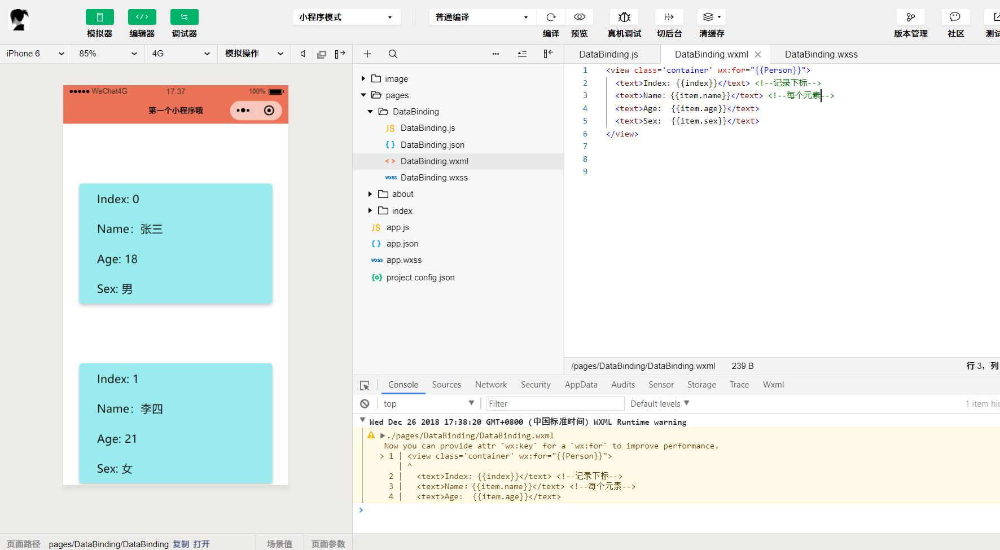
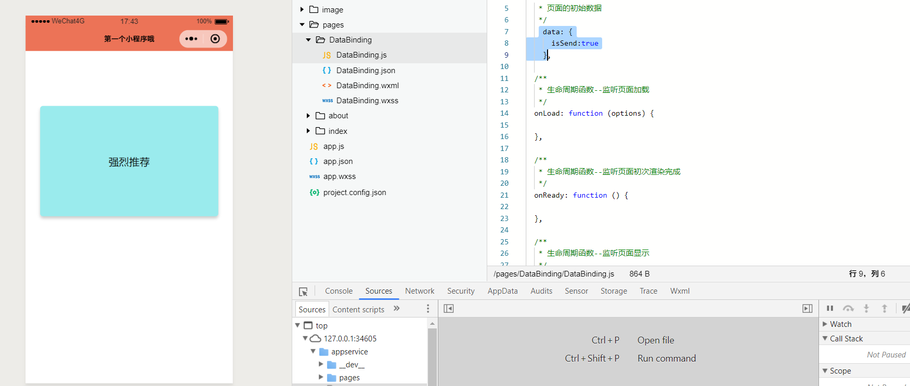
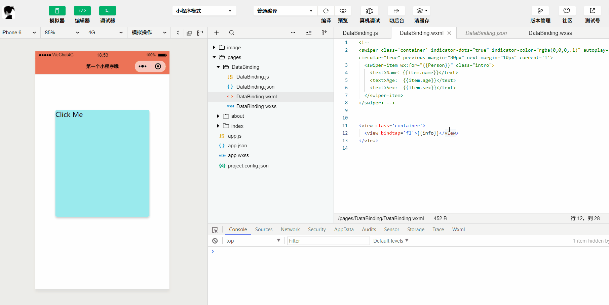

# WXML(WeiXin Markup Language)

## 数据绑定

**内容与属性**

```html
<view class='container'>
  <text class='{{cls}}'>Name：{{Person.name[1]}}</text>
  <text>Age:  {{Person.age}}</text>
  <text>Sex:  {{Person.sex}}</text>
</view>
```

```js
data: {
    Person:{
      "name":["张三","李四"],
      "age":18,
      "sex":"男"
    },
    cls:"content-cls"
  }
```



**三目运算**

```js
  data: {
    score:60
  }
```

```html
<view class='container'>
  <text>成绩判断： {{(score>60)?"合格":"不及格"}}</text>
</view>
```

**算术运算**

```js
data: {
      num1:50,
      num2:50
    }
```

```
<view class='container'>
  <text>{{num1*num2-1}}</text>
</view>


>>> 2499
```

**列表（循环）渲染**


```js
data: {
      Person: [
        {
          "name": "张三",
          "age": 18,
          "sex": "男"
        },
        {
          "name": "李四",
          "age": 21,
          "sex": "女"
        },
        {
          "name": "王五",
          "age": 16,
          "sex": "女"
        }
      ]
    }
```

```html
<view class='container' wx:for="{{Person}}">
  <text>Index: {{index}}</text>
  <text>Name：{{item.name}}</text>
  <text>Age:  {{item.age}}</text>
  <text>Sex:  {{item.sex}}</text>
</view>
```



**注意**

- 使用 wx:for-item 可以指定数组当前元素的变量名

- 使用 wx:for-index 可以指定数组当前下标的变量名

**条件（判断）渲染**

```html
<view class='container' >
  <text wx:if="{{isSend}}">强烈推荐</text>
</view>
```

```js
 data: {
      isSend:true
    }
```

根据isSend的True or False 来判断元素是否展示



**wx:if vs hidden**

- 两者都可以隐藏一个元素
- hidden活跃的始终被渲染 而 wx:if惰性的只有为true时才会渲染


### 组件学习

**swiper**轮播图


```
<swiper class='container' indicator-dots="true" indicator-color="rgba(0,0,0,.1)" autoplay="true" circular="true" previous-margin="80px" next-margin="10px" current='1'>
  <swiper-item wx:for="{{Person}}" class="intro">
    <text>Name：{{item.name}}</text> 
    <text>Age:  {{item.age}}</text>
    <text>Sex:  {{item.sex}}</text>
  </swiper-item>
</swiper>
```

- 是否显示面板指示点 `indicator-dots`
- 是否自动切换 `autoplay`
- 当前所在滑块的index`current`
- 自动切换时间间隔`interval`
- 滑动动画时长`duration`
- 是否采用衔接滑动`circular`

[更多查看官方文档](https://developers.weixin.qq.com/miniprogram/dev/component/swiper.html)

### 事件

**是什么**

事件机制-响应用户交互

- 事件是视图层到逻辑层的通讯方式

**使用**

```
<view class='container'> 
  <view bindtap='f1'>{{info}}</view>
</view
```

```
f1:function(event) {
      this.setData({
        info:"点我干啥！"
      })
    },

data: {
    info:"Click Me"
}
```



**分类**

- 冒泡事件：当一个组件上的事件被触发后，该事件会向父节点传递

- 非冒泡事件：当一个组件上的事件被触发后，该事件不会向父节点传递
