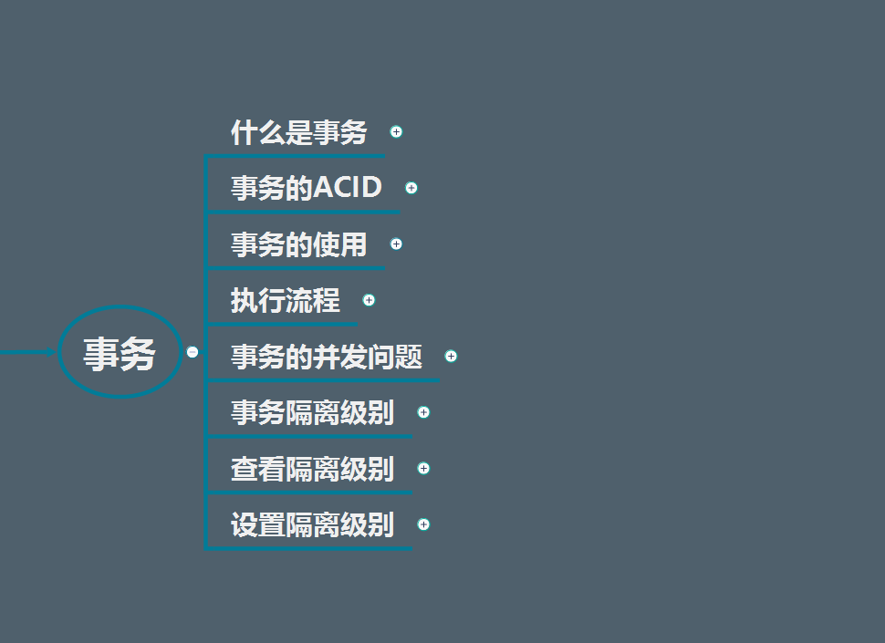

# 事务



> ## 什么是事务

每条sql语句都是一个事务，不可分割的操作。

不可分割的操作,假设该操作有ABCD四个步骤组成

- 若ABCD四个步骤都成功完成,则认为事务成功
- 若ABCD中任意一个步骤操作失败,则认为事务失败

**注意**：事务只对DML语句有效,对于DQL无效


> ## 事务的ACID

- 原子性（Atomicity）

原子性是指事务包含的所有操作要么全部成功，要么全部失败回滚

- 一致性（Consistency）

一致性是指事务必须使数据库从一个一致性状态变换到另一个一致性状态，也就是说一个事务执行之前和执行之后都必须处于一致性状态。

- 隔离性（Isolation）

隔离性是当多个用户并发访问数据库时，比如操作同一张表时，数据库为每一个用户开启的事务，不能被其他事务的操作所干扰，多个并发事务之间要相互隔离。

- 持久性（Durability）

持久性是指一个事务一旦被提交了，就不能再回滚了，已经把数据保存到数据库当中了。

> ## 事务的使用

- 开启事务`start transaction`

- 提交事务`commit`

- 回滚事务`rollback`

> ## 事务的并发问题

- 脏读

- 不可重复读

- 重复读

- 幻读

#### 脏读

老板要给程序员发工资，程序员的工资是3.6万/月。但是发工资时老板不小心按错了数字，按成3.9万/月，该钱已经打到程序员的户口，但是事务还没有提交，就在这时，程序员去查看自己这个月的工资，发现比往常多了3千元，以为涨工资了非常高兴。但是老板及时发现了不对，马上回滚差点就提交了的事务，将数字改成3.6万再提交

实际程序员这个月的工资还是3.6万，但是程序员看到的是3.9万。他看到的是老板还没提交事务时的数据。这就是脏读。


解决问题：`Read committed!`读提交

#### 不可重复读

程序员拿着工资卡（卡里当然是只有3.6万），当他买单时（程序员事务开启），收费系统事先检测到他的卡里有3.6万，就在这个时候！！程序员的妻子要把钱全部转出充当家用，并提交。当收费系统准备扣款时，再检测卡里的金额，发现已经没钱了。程序员就会很郁闷，明明卡里是有钱的…

一个事务范围内两个相同的查询却返回了不同数据，这就是不可重复读

解决问题：`Repeatable read`

#### 重复读

程序员拿着工资卡（卡里还是有3.6万），当他买时（事务开启，不允许其他事务的UPDATE修改操作），收费系统事先检测到他的卡里有3.6万。这个时候他的妻子不能转出金额了。接下来收费系统就可以扣款了。

#### 幻读

程序员某一天去消费，花了2千元，然后他的妻子去查看他今天的消费记录（，妻子事务开启），看到确实是花了2千元，就在这个时候，程序员花了1万买了一部电脑，即新增INSERT了一条消费记录，并提交。当妻子打印程序员的消费记录清单时（妻子事务提交），发现花了1.2万元，似乎出现了幻觉，这就是幻读。

解决问题：`Serializable`

#### 对应关系

|  事务隔离级别 |脏读   | 不可重复读  |  幻读 |
| ------------ | ------------ | ------------ | ------------ |
|  读未提交（read-uncommitted） | 是  |是   |是   |
| 不可重复读（read-committed）  | 否  |是   |是   |
|  可重复读（repeatable-read） |  否|  否 | 是  |
|  串行化（serializable） |   否| 否  |否   |


> ## 事务的隔离级别

- Read uncommitted 就是一个事务可以读取另一个未提交事务的数据

- Read committed 一个事务要等另一个事务提交后才能读取数据

- Repeatable read 就是在开始读取数据（事务开启）时，不再允许修改操作

- Serializable  在该级别下，事务串行化顺序执行，可以避免脏读、不可重复读与幻读

> ## 查看隔离级别

`select @@global.tx_isolation,@@tx_isolation;`

> ## 设置隔离级别

- 全局
```
set global transaction isolation level read committed; 
```
- 当前会话
```
 set session transaction isolation level read committed;
```
