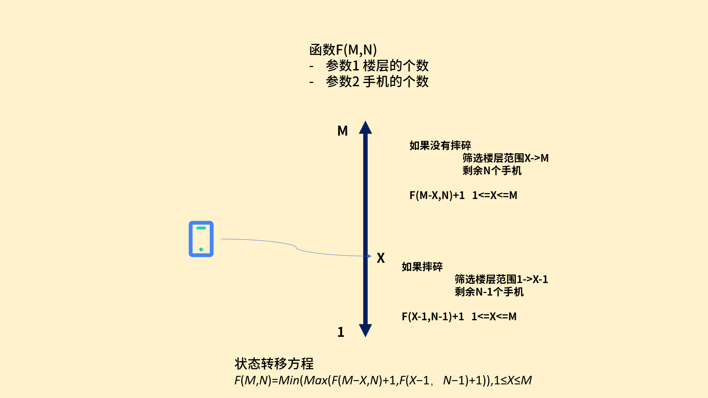

## 算法训练

> 区间K大数查询

给定一个序列，每次询问序列中第l个数到第r个数中第K大的数是哪个

**思路**


对序列进行排序，在求指定index

### 测试次数




```
package 蓝桥杯.第九届;

public class Pass4_测试次数 {
    /**
     *  x 星球的居民脾气不太好，但好在他们生气的时候唯一的异常举动是：摔手机。
     * 各大厂商也就纷纷推出各种耐摔型手机。x 星球的质监局规定了手机必须经过耐摔测试，并且评定出一个耐摔指数来，之后才允许上市流通。
     *
     * x 星球有很多高耸入云的高塔，刚好可以用来做耐摔测试。塔的每一层高度都是一样的，与地球上稍有不同的是，他们的第一层不是地面，而是相当于我们的 2 楼。
     *
     * 如果手机从第 7 层扔下去没摔坏，但第 8 层摔坏了，则手机耐摔指数 = 7。
     * 特别地，如果手机从第 1 层扔下去就坏了，则耐摔指数 = 0。
     * 如果到了塔的最高层第 n 层扔没摔坏，则耐摔指数 = n
     *
     * 为了减少测试次数，从每个厂家抽样 3 部手机参加测试。
     *
     * 某次测试的塔高为 1000 层，如果我们总是采用最佳策略，在最坏的运气下最多需要测试多少次才能确定手机的耐摔指数呢？
     *
     * 请填写这个 return最多测试次数
     *
     * >>>解
     *  变量：共M楼层 N个手机 X层
     *  return 最多测试次数
     *  方式自底向上
     * */
    static int getMinSteps(int num, int floorNum) {
        if (num < 1 || floorNum < 1)
            return 0;

        // 备忘录，存储num个手机，floorNum层楼条件下的最优化尝试次数
        int[][] cache = new int[num + 1][floorNum + 1];
        // 把备忘录每个元素初始化成最大的尝试次数
        for (int i = 1; i <= num; i++)
            for (int j = 1; j <= floorNum; j++)
                cache[i][j] = j;

        for (int n = 2; n <= num; n++)
            for (int m = 1; m <= floorNum; m++)
                for (int k = 1; k < m; k++)
                    // 扔手机的楼层从1到m枚举一遍，如果当前算出的尝试次数小于上一次算出的尝试次数，则取代上一次的尝试次数。
                    cache[n][m] = Math.min(cache[n][m], 1 + Math.max(cache[n - 1][k - 1], cache[n][m - k]));

        return cache[num][floorNum];
    }
    public static void main(String[] args){
        System.out.println(getMinSteps(3,1000));
    }
}

```

### 核桃的数量


### 五星填数

```java

import org.junit.Test;

import java.util.Arrays;

public class Main {
    /**
     *  标题：五星填数
     *
     * 如【图1.png】的五星图案节点填上数字：1~12，除去7和11。
     * 要求每条直线上数字和相等。
     *
     * 如图就是恰当的填法。
     *
     * 请你利用计算机搜索所有可能的填法有多少种。
     * 注意：旋转或镜像后相同的算同一种填法。
     *
     * 请提交表示方案数目的整数，不要填写任何其它内容。
     * */
    /*全排列*/
    public void Af(int[] arr, int k){
        if(k == arr.length-1){
            count(arr);
            return;
        }
        for(int i=k; i<arr.length; i++){
            int tmp = arr[k];
            arr[k] = arr[i];
            arr[i] = tmp;
            Af(arr,k+1);
            tmp = arr[k];
            arr[k] = arr[i];
            arr[i] = tmp;
        }
    }
    static int sum=0;
    public void count(int[] a){
        /*所有可能出现的情况*/
        int r1 =a[0] + a[2]+ a[5] + a[8];
        int r2 = a[0] +a[3]+a[6]+a[9];
        int r3 = a[1] +a[2]+a[3]+a[4];
        int r4 = a[1] +a[5]+a[7]+a[9];
        int r5 = a[4] +a[6]+a[7]+a[8];

        if(r1==r2 && r2==r3 && r3==r4 && r4==r5){
            sum++;
            System.out.println(Arrays.toString(a));
        }
    }
    @Test
    public void f(){
        int arr[] = {1,2,3,4,5,6,8,9,10,12};
        Af(arr,0);
        System.out.println(sum/10);
    }
}
```

**思路**

1. 对10个数字进行全排列
2. 进行筛选
3. 一种情况对应的旋转有5种，每种又存在对应的镜像，所以一种情况对应的旋转和镜像应该有10种结果除以10


### 穿越雷区


X星的坦克战车很奇怪，它必须交替地穿越正能量辐射区和负能量辐射区才能保持正常运转，否则将报废。
某坦克需要从A区到B区去（A，B区本身是安全区，没有正能量或负能量特征），怎样走才能路径最短？

已知的地图是一个方阵，上面用字母标出了A，B区，其它区都标了正号或负号分别表示正负能量辐射区。

```java
import java.util.Scanner;

public class Main {
    /*下次的路径*/
    public static int[][] next = {
            {0,1},
            {1,0},
            {0,-1},
            {-1,0}
    };
    static int min = Integer.MAX_VALUE;
    static int count = 0;
    static char[][] modelArr = null; //Flag
    //DFS
    /**
     * 参数1：map
     * 参数2：x
     * 参数3：y
     * */
    public static void dfs(char[][] localArr, int x, int y){
        //枚举四种走法
        for(int i=0; i<next.length; i++){
            int dx = x+next[i][0];
            int dy = y+next[i][1];
            if(dx>=0 && dx<localArr[0].length && dy>=0 && dy<localArr.length){//确保不会越界
                if(localArr[x][y] == 'B'){
                    iprint(localArr);
                    if(count<min)
                        min = count;
                    count--;
                    System.out.println(count+"\n");
                    return;
                }
                if(canWalk(localArr,x,y,dx,dy)){
                    count++;
                    localArr[x][y] = '0';
                    dfs(localArr,dx,dy);
                    localArr[x][y] = modelArr[x][y];
                }
            }
        }
        count--;

    }

    //是否可以通过呢
    public static boolean canWalk(char[][] arr, int x1, int y1, int x2, int y2){
        return  (arr[x1][y1] !=arr[x2][y2]) && (arr[x2][y2]!='0');//当前位置不可以等于下一个位置的值 下一个位置不可以是已访问过的
    }
    //打印输出
    public static void iprint(char[][] a){
        for(int i=0; i<a.length; i++){
            for(int j=0; j<a.length; j++){
                System.out.print(a[i][j] + " ");
            }
            System.out.println();
        }
    }
    public static void main(String[] args){
        Scanner sc = new Scanner(System.in);
        int line = Integer.parseInt(sc.nextLine());
        int x=0,y=0; //当前坐标
        modelArr = new char[line][line];
        char[][] newArr = new char[line][line]; //输入Map
        for(int i=0; i<line; i++){
            char[] chArr = sc.nextLine().toCharArray();
            for(int j=0; j<chArr.length; j+=2){//跳过空格
                int ndx = j/2;
                char ch = chArr[j];
                modelArr[i][ndx] = newArr[i][ndx] = ch;
                if(ch=='A'){ //确立起始位置
                    x = i;
                    y = ndx;
                }
            }
        }
        /*End*/
        iprint(modelArr);
        System.out.println("Start:>>>\n");
        dfs(newArr,x,y);
    }
}
```

### 胡同门牌号

```java
public class Main {
    /**
     * 小明家住在一条胡同里。胡同里的门牌号都是连续的正整数，由于历史原因，最小的号码并不是从1开始排的。
     * 有一天小明突然发现了有趣的事情：
     * 如果除去小明家不算，胡同里的其它门牌号加起来，刚好是100！
     * 并且，小明家的门牌号刚好等于胡同里其它住户的个数
     *
     * >>> 解
     *  sum-小明家=100
     *  小明家=cnt-1
     * */
    public static void main(String[] args){
        int sum; //门牌总和；
        int cnt;//用户总和；

        //枚举
        for(int i=2; i<=100; i++){
            sum=0; cnt=0; //初始化总数
            for(int j=i; j<=100; j++){
                cnt++;
                sum+=j;
                if(sum-cnt==99 && cnt-1>=i){
                    System.out.println(cnt-1);//小明 = cnt-1
                }
            }
        }
    }
}
```

### 埃及分数

 古埃及曾经创造出灿烂的人类文明，他们的分数表示却很令人不解。古埃及喜欢把一个分数分解为类似： 1/a + 1/b 的格式. 这里，a 和 b 必须是不同的两个整数，分子必须为 1. 比如，2/15 一共有 4 种不同的分解法.那么， 2/45 一共有多少个不同的埃及分解呢


**思路**

枚举a,b分别代表两个分数的分母。根据公式 1/a+1/b=w/n. `w=a+b n=a*b`.

最后需要约分到最简 然后与2/45比较


### 神奇6位数

有一个6位的正整数，它有个很神奇的性质：

分别用2 3 4 5 6去乘它，得到的仍然是6位数，并且乘积中所包含的数字与这个6位数完全一样！只不过是它们的顺序重新排列了而已。

请计算出这个6位数。

**思路**

枚举100000-999999. 题中两个重要条件`x*i=sort(x)` 所以快速方法是对整数转数组进行排序再返回整数 通过对比得出判断条件


### 数独游戏

玩家需要根据9×9盘面上的已知数字，推理出所有剩余空格的数字，并满足每一行、每一列、每一个同色九宫内的数字均含1-9，不重复

格式要求，输入9行，每行9个数字，0代表未知，其它数字为已知。
输出9行，每行9个数字表示数独的解

```
005300000
800000020
070010500
400005300
010070006
003200080
060500009
004000030
000009700


145327698
839654127
672918543
496185372
218473956
753296481
367542819
984761235
521839764
```

**思路**

```java
//行列填入元素
int[][] table = new int[9][9];
dfs(int x, int y){
    //终止
    if(x==9){
        退出
    }

    if(table[x][y])=0{
        for(i=1...9){
            boolean res = check(table,x,y,i);
            if(res){
                table[x][y] = i;
                dfs(x,y+1);
               
            }
        }
         table[x][y] = 0;//回溯
    }else{
        //继续下一个处理的位置
    }
}
```

```java
import java.util.Scanner;

public class Main {
    static int[][] qipan = null;
    public static void main(String[] args){
        Scanner sc = new Scanner(System.in);

        qipan = new int[9][9];
        //9*9的格子
        for(int i=0; i<9;i++){
            String line = sc.nextLine();
            for(int j=0; j<9; j++){
                qipan[i][j] = line.charAt(j)-'0';
            }
        }
        play(0,0);
    }
    /*向行、列填入元素*/
    public static void play(int x, int y){
        if(x==9){/*终止条件*/
            print(qipan);
            return;
        }
        if(qipan[x][y]==0){
            for(int value=1; value<=9;value++){//平行关系
                if(checkg(x,y,value)!=0 && checkl(x,y,value)!=0){ //判断
                    qipan[x][y] = value;
                    //输入下一个空格数字
                    if(y<8)
                        play(x,y+1);
                    else if(x<=8 && y==8)
                        play(x+1,0);
                    qipan[x][y] = 0;
                }
            }
        }else{
            if(y<8)
                play(x,y+1);
            else if(x<=8 && y==8)
                play(x+1,0);
        }
    }
    /**
     *  棋盘的行和列不能有重复的元素
     * */
    public static int checkl(int x, int y, int value){
        for(int i=0;i<9;i++)
        {
            if(qipan[x][i]==value||qipan[i][y]==value)
                return 0;
        }
        return 1;
    }
    /**
     * 3*3判断是否重复
     * */
    public static int checkg(int x,int y,int value)
    {
        if(x>=0&&x<=2)  x=0;
        if(x>=3&&x<=5)  x=3;
        if(x>=6&&x<=8)  x=6;

        if(y>=0&& y<=2) y=0;
        if(y>=3&& y<=5) y=3;
        if(y>=6&& y<=8) y=6;

        for(int i=x;i<x+3;i++) {
            for(int j=y;j<y+3;j++) {
                //	System.out.println(i+" "+j);
                if(qipan[i][j]==value) {//    //有重复数字
                    return 0;
                }
            }
        }
        return 1;   //无重复数字
    }

    /*打印*/
    public static void print(int[][] arr){
        for(int i=0; i<arr.length; i++){
            for(int j=0; j<arr.length; j++){
                System.out.print(arr[i][j]);
            }
            System.out.println();
        }
    }
}
```
