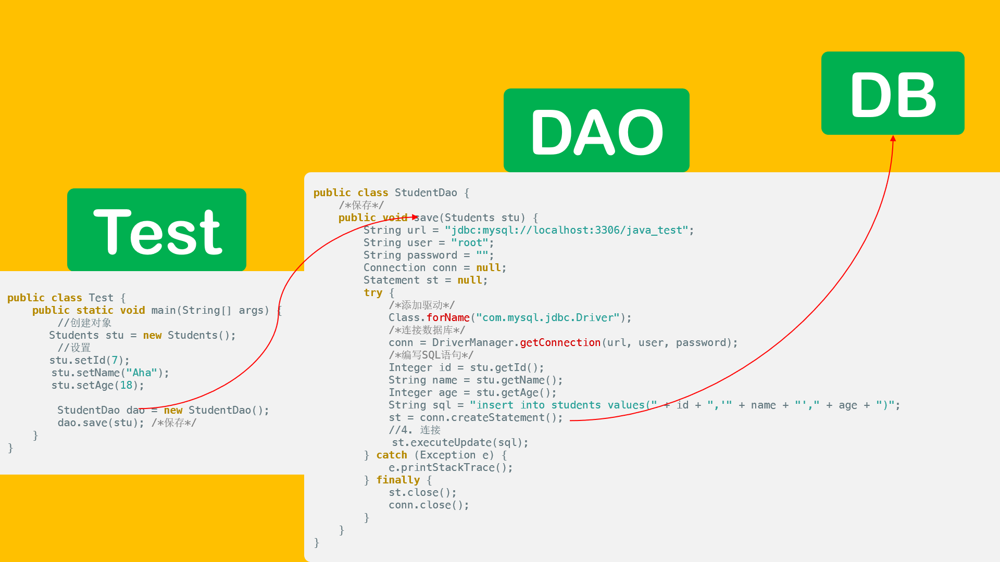
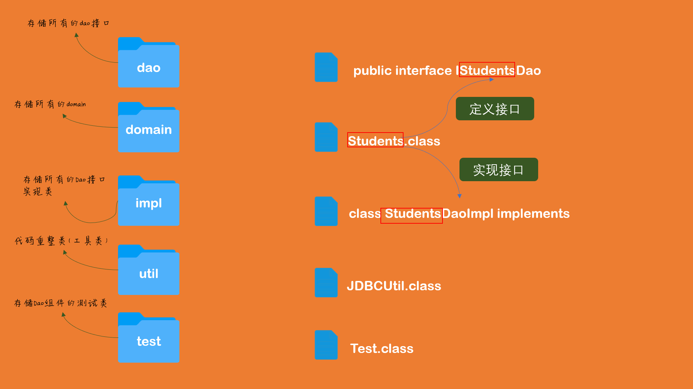

<style type="text/css">
    h1 {

        font-weight: 400;
    }
    img {
        border-radius: 10px;
        box-shadow: 0 2px 8px rgba(0,0,0,.3);
    }
    body {
        background-color: #FDF6E3;
/*      margin:0;
        outline:none;
        border:none;
        max-width: 100%;*/

    }
    import::before{
        display: inline-block;
        content: "";
        width: 10px;
        height: 10px;
        background-color: red;
        margin-right: 10px;
        border-radius: 50%;
    }
    import {
        font-size:14px;
        font-weight: bold;
        padding:0.55rem;
        border-radius:5px; 
        color:#eb5055;
    }
    .markdown-body blockquote{
        border-left: 4px solid tomato;
    }
</style>

# DAO设计

#### 为什么使用DAO设计

没有使用DAO存在的问题，多个地方都要同时做CRUD操作时，重复的代码就会很多

#### 什么是DAO

Data Access Object（数据存取对象）

位于业务逻辑（）和持久化数据（）之间，实现对持久化数据的访问

# ORM

#### 什么是ORM

对象关系映射

- 将关系数据库中表中的记录映射成为对象，以对象的形式展现
- 因此ORM的目的是为了方便开发人员以面向对象的思想来实现对数据库的操作。

```
面向对象概念	面向关系概念

类				表
对象关系映射      记录（行）
属性				字段（列）
```


比如创建了一个students表,分别有id，name，age字段，这时候就可以创建一个Students类来操作

```java
import lombok.Getter;
import lombok.Setter;

@Getter@Setter
public class Students {
    Integer id;
    String name;
    Integer age;

}
```

仅仅创建一个类是不够的，还需要一个关系映射

```java
public class StudentDao {
    /*保存*/
    public void save(Students stu){
        String url = "jdbc:mysql://localhost:3306/java_test";
        String user = "root";
        String password = "";
        Connection conn = null;
        Statement st = null;
        try{
            /*添加驱动*/
            Class.forName("com.mysql.jdbc.Driver");
            /*连接数据库*/
            conn = DriverManager.getConnection(url,user,password);
            /*编写SQL语句*/
            Integer id = stu.getId();
            String name = stu.getName();
            Integer age = stu.getAge();
            String sql = "insert into students values("+id+",'"+name+"',"+age+")"; //sql语句
            System.out.println(sql);/*测试打印sql语句*/
            st = conn.createStatement();

            //4. 连接
            int row = st.executeUpdate(sql);
            System.out.println(row);/*成功的行数*/
        }catch(Exception e){
            e.printStackTrace();
        }finally{
            //5. 释放资源
            if(st != null){
                try{
                    st.close();
                }catch(Exception e){
                    e.printStackTrace();
                }
            }
            if(conn != null){
                try{
                    conn.close();
                }catch(Exception e){
                    e.printStackTrace();
                }
            }
        }
    }
    /*获取*/

    /*更新*/
}
```



# 规范代码

体验了DAO设计的代码之后感觉操作数据库思路更加清晰。那就更加完善一下以便日后使用

#### 编写DAO组件

1. 定义DAO接口
2. 编写对应DAO实现类

#### 命名规范

- 整体规范
    - 域名导写.模块名称.组件名称

- DAO包规范
    - domain 存储所有的domain
    - dao 存储所有的DAO接口
    - impl 存储所有的DAO接口实现类
    - test 存储DAO组件的测试类




# Demo

编写学生类

- com.Tashi.domain
```java
import lombok.Getter;
import lombok.Setter;

@Getter@Setter
public class Students {
    private Integer id;
    private String name;
    private Integer age;

    @Override
    public String toString() {
        return "Dao{" +
                "id=" + id +
                ", name='" + name + '\'' +
                ", age=" + age +
                '}';
    }
}
```

编写接口类

- com.Tashi.dao
```java
import JDBC.Tashi.domain.Students;
import java.util.List;

public interface IStudentsDao {
    //1.保存数据
    void save(Students stu);
    //2.修改指定学生信息
    void update(int id,Students stu);
    //3.删除学生
    void delete(int id);
    //4.获取指定学生
    Students get(int id);
    //5.获取所有学生
    List<Students> getAll();
}
```

实现接口类

- com.Tashi.impl
```java
import JDBC.Tashi.dao.IStudentsDao;
import JDBC.Tashi.domain.Students;
import JDBC.Tashi.util.JDBCUtil;

import java.sql.*;
import java.util.ArrayList;
import java.util.List;

public class StudentsDaoImpl implements IStudentsDao {

    @Override
    public void save(Students stu){
        Connection conn = null;
        Statement st = null;
        try{
            /*连接*/
            conn = JDBCUtil.getConn();
            /*编写SQL语句*/
            st = conn.createStatement();

            Integer id = stu.getId();
            String name = stu.getName(); //参数
            Integer age = stu.getAge();
            String sql ="insert into dao values("+id+",'"+name+"',"+age+")";
            System.out.println(sql);
            /*执行语句*/
            /*测试数据*/
            int row = st.executeUpdate(sql);
            System.out.println(row);
        }catch(Exception e){
            e.printStackTrace();
        }finally {
            JDBCUtil.close(conn,st,null);
        }

    }
    @Override
    public void update(int id, Students stu){
        Connection conn = null;
        Statement st = null;
        try{
            /*连接对象*/
            conn = JDBCUtil.getConn();
            /*编写SQL语句*/
            st = conn.createStatement();
            String name = stu.getName();
            int age = stu.getAge();
            String sql ="update dao set name= '"+name+"', age="+age+" where id="+id;
            System.out.println(sql);
            /*执行语句*/
            /*测试数据*/
            int row = st.executeUpdate(sql);
            System.out.println(row);
        }catch(Exception e){
            e.printStackTrace();
        }finally {
            /*释放资源*/
            JDBCUtil.close(conn,st,null);
        }
    }
    @Override
    public void delete(int id){

        Connection conn = null;
        Statement st = null;
        try{
            /*连接对象*/
            conn = JDBCUtil.getConn();
            /*编写SQL语句*/
            st = conn.createStatement();
            String sql ="delete from dao where id="+id+"";
            System.out.println(sql);
            /*执行语句*/
            /*测试数据*/
            int row = st.executeUpdate(sql);
            System.out.println(row);
        }catch(Exception e){
            e.printStackTrace();
        }finally {
            /*释放资源*/
            JDBCUtil.close(conn,st,null);
        }
    }
    @Override
    public Students get(int id){
        Connection conn = null;
        Statement st = null;
        ResultSet res = null;
        try{
            /*连接对象*/
            conn = JDBCUtil.getConn();
            /*编写SQL语句*/
            st = conn.createStatement();

            String sql ="select * from dao where id="+id;
            System.out.println(sql);
            /*执行语句*/
            /*测试数据*/
            res = st.executeQuery(sql);
            if (res.next()){
                Dao stu = new Dao();
                stu.setName(res.getString("name"));
                stu.setAge(res.getInt("age"));
                stu.setId(res.getInt("id"));
                return stu;
            }
        }catch(Exception e){
            e.printStackTrace();
        }finally {
            /*释放资源*/
            JDBCUtil.close(conn,st,res);
        }
        return null;
    }
    @Override
    public List<Students> getAll(){
        Connection conn = null;
        Statement st = null;
        ResultSet res = null;
        try{
            /*连接对象*/
            conn = JDBCUtil.getConn();
            /*编写SQL语句*/
            st = conn.createStatement();
            String sql ="select * from dao";
            System.out.println(sql);
            /*执行语句*/
            /*测试数据*/
            res = st.executeQuery(sql);
            //创建一个集合
            List<Students> list = new ArrayList<Students>();
            while (res.next()){
                Students stu = new Students();
                stu.setName(res.getString("name"));
                stu.setAge(res.getInt("age"));
                stu.setId(res.getInt("id"));
                list.add(stu);
            }
            return list; //list返回

        }catch(Exception e){
            e.printStackTrace();
        }finally {
            /*释放资源*/
            JDBCUtil.close(conn,st,res);
        }
        return null;
    }
}
```

封装类

- com.Tashi.util
```java
import javax.xml.transform.Result;
import java.sql.*;

public class JDBCUtil {
    public static String url = "jdbc:mysql://localhost:3306/java_test";
    public static String user = "root";
    public static String password = "";
    public static String driverName = "com.mysql.jdbc.Driver"; //选择库
    static {
        try{
            /*加载驱动*/
            Class.forName(JDBCUtil.driverName);
        }catch (Exception e){
            e.printStackTrace();
        }
    }
    /*获取连接对象*/
    public static Connection getConn(){
        try{
            /*连接数据库*/
            return DriverManager.getConnection(JDBCUtil.url,JDBCUtil.user,JDBCUtil.password);
        }catch (Exception e){
            e.printStackTrace();
        }
        return null;
    }
    /*释放资源*/
    public static void close(Connection conn, Statement st, ResultSet res){
        if(res != null){
            try {
                res.close();
            }catch (SQLException e){
                e.printStackTrace();
            }
        }
        if(st != null){
            try{
                st.close();
            }catch(Exception e){
                e.printStackTrace();
            }
        }
        if(conn != null){
            try{
                conn.close();
            }catch(Exception e){
                e.printStackTrace();
            }
        }
    }
}
```

然后就可以测试喽

- com.Tashi.test
```java
import JDBC.Tashi.dao.IStudentsDao;
import JDBC.Tashi.domain.Students;
import JDBC.Tashi.impl.StudentsDaoImpl;

import javax.persistence.Id;
import java.util.List;

public class Test {
    public static void main(String[] args){
        Students stu = new Students(); //创建对象

        stu.setId(10); //输入数据
        stu.setName("123");
        stu.setAge(5);

        /*接口类*/
        IStudentsDao dao = new StudentsDaoImpl();
        dao.save(stu); //保存
//        dao.delete(2); //删除
//        dao.update(3,stu);//更新
//        Dao d = dao.get(3);
//        System.out.println(d.toString()); //查找

//        List<Dao> allStu = dao.getAll();
//        System.out.println(allStu);
    }
}
```


